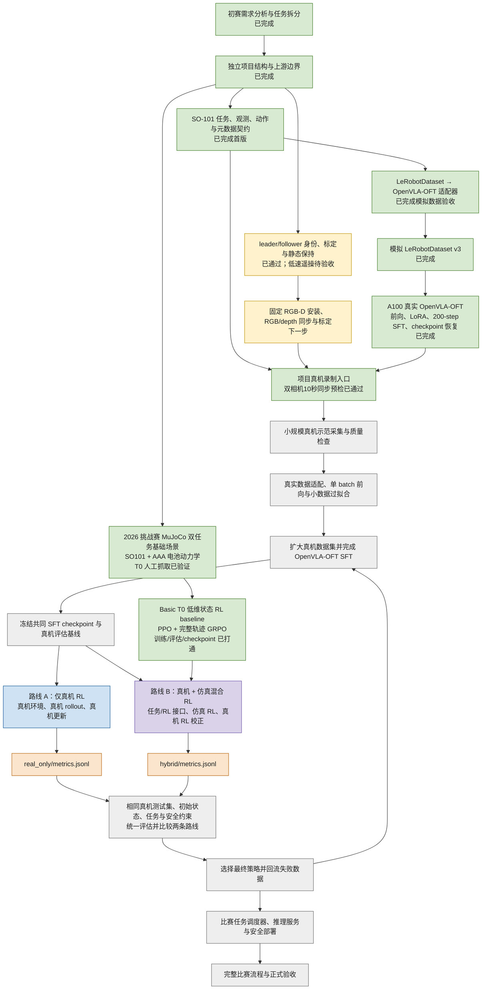
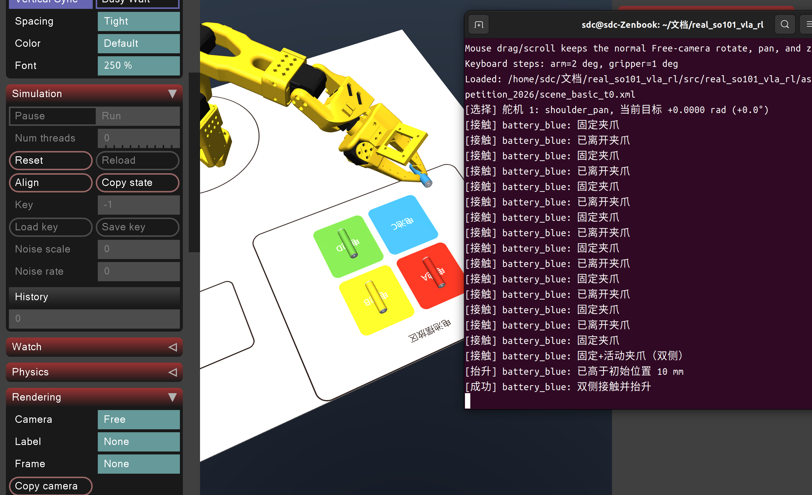
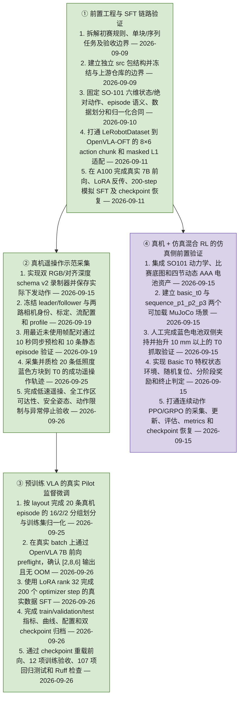

# SO-101 实体机械臂 VLA-RL 项目

## 总览

本项目使用 SO-101 实体机械臂完成多色方块识别、抓取和顺序放置任务。由于实物条件限制，真机录制和 OpenVLA 训练统一使用红、黄、蓝、绿四个方块。当前已经完成 schema v2 双 RGB/对齐深度数据契约、LeRobotDataset → OpenVLA-OFT 适配器、云端真实模型联调和 2026 挑战赛 MuJoCo 双任务场景。MuJoCo `basic_t0` 仍使用已验证的 AAA 电池资产，这是明确记录的 sim-to-real 形状差异。实体双相机已冻结身份与流配置；历史 v2 profile 使用腕部手动曝光 `300`，低照度 pilot 的 v3 profile 使用曝光 `150`、增益 `0`。此前 10 秒正式预检实测 `300/300` 帧有效、`29.92 FPS`、p95 时间差 `21.40 ms`，已通过 `25 ms` 合同。



图中绿色表示已经完成并有验证结果，黄色表示当前优先任务，灰色表示后续公共流程，蓝色和紫色分别表示两条 RL 对照路线。当前 PPO/GRPO 结果是验证训练软件链路的 MLP baseline，不是已达到任务成功率的 VLA 策略。两条最终对照路线仍必须从同一个真实 SFT checkpoint 出发，并使用相同的真机测试协议生成最终比较指标。

## 开发调试规范

- **以实际进展为准**：只记录已经确认的配置、操作和结果；未验证的内容明确标注，不把计划写成已实现的功能。
- **统一写作结构**：操作说明按照“为什么 → 怎么做”组织。先解释操作的原因及跳过它的影响，再说明程序解决问题的思路，最后给出命令行启动方式、操作步骤和成功判断方法。
- **保证操作可复现**：记录运行环境、代码版本、完整命令及关键参数。端口、设备类型和设备名称应与实际硬件一致。
- **保留排查依据**：遇到问题时记录原始报错、触发步骤、排查过程、确认的原因和修复后的验证结果，区分推测与已确认的结论。
- **逐步验证硬件**：先确认供电和通信，再完成舵机初始化、机械臂校准及后续控制调试。改接舵机线前先断开舵机电源；首次动作测试使用小幅度动作，并确保能够及时停止。
- **同步维护代码和文档**：启动命令、配置或操作流程变化后及时更新对应章节。密钥、数据集和模型权重不直接提交到仓库。

## 项目目录结构

当前仓库只建立项目自身的最小 Python 包结构。功能代码在对应功能开始开发时逐步加入：

```text
real_so101_vla_rl/
├── pyproject.toml
├── src/
│   └── real_so101_vla_rl/
│       ├── data/             # 数据加载、转换和检查
│       ├── assets/mujoco/    # SO101、比赛底图、电池和 MuJoCo 场景资产
│       ├── models/           # OpenVLA 模型适配与微调
│       ├── robot/            # SO-101 控制与安全接口
│       ├── envs/             # 仿真与真机环境
│       ├── rewards/          # 比赛规则对应的奖励计算
│       └── rl/
│           ├── rollout/      # 仿真与真机轨迹采集（不代指整个训练流程）
│           ├── algorithms/   # 强化学习算法
│           └── trainer/      # VLA-RL 训练调度
├── configs/
│   ├── robot/                # 机器人与相机配置
│   ├── sft/                  # SFT-LoRA 配置
│   └── rl/                   # 强化学习配置
├── scripts/                  # 数据、训练、评估和部署入口
├── tests/                    # 自动化测试
├── RLinf/                    # 本地参考仓库，不纳入版本管理
└── SimpleVLA-RL/             # 本地参考仓库，不纳入版本管理
```

`RLinf/` 和 `SimpleVLA-RL/` 保持原样并由 `.gitignore` 忽略。项目后续只迁移实际需要的最小实现，迁移后的代码在本项目中独立维护；完成迁移和验证后可以删除本地参考目录。

## 第一章：so101组装与调试

### 1.1 舵机的标定与初始化

#### 为什么

机械臂校准前，需要先为每颗舵机设置唯一的 ID，并统一通信波特率。新舵机通常使用默认 ID，多颗舵机直接串联后可能出现 ID 冲突；如果 ID 或波特率与程序预期不一致，程序就无法正常识别和访问各个关节，影响后续机械臂的标定。

例如，运行 `lerobot-calibrate` 时出现以下报错，说明程序在连接检查阶段没有收到预期 ID 的舵机回复，尚未进入机械臂校准：

```text
Missing motor IDs:
  - 1 (expected model: 777)
  - 2 (expected model: 777)
  - 3 (expected model: 777)
  - 4 (expected model: 777)
  - 5 (expected model: 777)
  - 6 (expected model: 777)

Full found motor list (id: model_number):
{}
```

这个报错也可能由供电、端口或接线问题引起。本次排查中，已确认供电和端口无误，但跳过了舵机 ID 初始化，因此先补做初始化。

这里的 ID 初始化用于建立各关节的通信身份；后续的机械臂校准用于确定关节零位和运动范围，两步需要依次完成。

#### 怎么做

**程序解决问题的思路**

LeRobot 使用 `lerobot-setup-motors` 逐颗配置舵机。每次只将一颗舵机接入控制板，避免默认 ID 相同导致通信冲突。程序查找该舵机当前的通信参数，关闭其力矩输出，写入对应关节的目标 ID，并将波特率设置为总线使用的默认值。

这些参数保存在舵机内部，正常断电后仍然保留，因此通常只需初始化一次。当前本机版本按照以下顺序提示连接舵机：

| 操作顺序 | 程序提示名称 | 对应关节 | 目标 ID |
| --- | --- | --- | --- |
| 1 | `gripper` | 夹爪 | 6 |
| 2 | `wrist_roll` | 手腕旋转 | 5 |
| 3 | `wrist_flex` | 手腕俯仰 | 4 |
| 4 | `elbow_flex` | 肘部 | 3 |
| 5 | `shoulder_lift` | 肩部抬升 | 2 |
| 6 | `shoulder_pan` | 底座旋转 | 1 |

**命令行启动与操作**

以下以 leader 臂为例，已确认其端口为 `/dev/ttyACM0`。在终端中运行：

```bash
conda activate lerobot

lerobot-setup-motors \
  --teleop.type=so101_leader \
  --teleop.port=/dev/ttyACM0
```

1. 根据终端提示确定当前需要设置的舵机。
2. 断开舵机电源，让控制板只连接当前指定的那一颗舵机。该舵机的另一个接口也不能继续串联其他舵机；机械结构可以保持装好。
3. 恢复舵机供电，再按 Enter，让程序配置该舵机。USB 可以保持连接。
4. 确认终端显示该舵机 ID 设置成功，例如 `'gripper' motor id set to 6`，再根据下一条提示重复上述操作。
5. 六颗舵机全部设置成功后，断开舵机电源，恢复完整串联接线，再重新供电。

随后启动机械臂校准：

```bash
lerobot-calibrate \
  --teleop.type=so101_leader \
  --teleop.port=/dev/ttyACM0 \
  --teleop.id=my_leader_arm
```

`--teleop.id=my_leader_arm` 是用于关联校准文件的机械臂名称，不是舵机 ID，也不会替代初始化操作。

程序通过连接检查并提示将机械臂移动到运动范围中间位置，说明已经进入校准流程；接着按终端提示完成中间位置及关节运动范围采集。出现 `Calibration saved to ...` 后，确认校准文件已保存。

如果初始化时单颗舵机就无法识别，应保留完整报错，检查该舵机的供电、接线及型号，解决后再继续。

## 第二章：初赛任务需求分析

### 2.1 任务目标与规则边界

初赛原任务为“机械臂多色电池识别与序列摆放（线上）”。本项目真机阶段因实物限制，使用外形、尺寸一致的红、蓝、黄、绿方块代替电池；颜色、初始区和目标区语义不变。机械臂需要完成颜色识别、抓取、搬运和放置。

初赛包含两个任务：

1. **基础单块抓取与放置**：根据目标颜色，从初始摆放区抓取一个方块，放入基础目标区 `T0`。
2. **指定序列精度摆放**：根据三色顺序，依次把对应方块放入序列区 `P1`、`P2`、`P3`。

比赛总分 100 分：基础单块抓取与放置 40 分、指定序列精度摆放 50 分、时间效率 10 分。单次比赛建议在 180 秒内完成。参赛视频必须为单镜头连续、未经剪辑的完整录像，执行过程中不得人工干预机械臂或修正方块位置。

本项目先采用单臂方案。规则允许单臂或双臂参赛，双臂不额外加分，因此单套 SO-101 follower 臂已经能够覆盖初赛任务。

### 2.2 功能拆分

完整任务可以拆成“接收任务 → 感知场景 → 选择目标 → 抓取 → 搬运 → 放置 → 验证结果”的闭环。

#### 2.2.1 任务指令输入

系统需要支持两类任务参数：

- 单块任务：输入一种目标颜色，例如“将红色方块放入 T0”。
- 序列任务：输入三个有顺序的目标颜色，例如“蓝、红、黄”，并依次映射到 `P1`、`P2`、`P3`。

首版可以通过命令行参数或配置文件输入任务，后续再接入自然语言指令。无论采用哪种输入方式，程序内部都应转换成统一的数据结构，例如：

```text
任务类型：sequence
目标序列：[blue, red, yellow]
目标区域：[P1, P2, P3]
```

#### 2.2.2 场景感知

系统需要从相机画面中获得以下信息：

- 识别红、蓝、黄、绿四种方块。
- 确定每个方块在初始区中的位置和朝向。
- 确定 `T0`、`P1`、`P2`、`P3` 的位置。
- 区分序列区的外框与内框，为高精度放置提供目标范围。
- 在抓取和放置后确认方块是否仍在夹爪中、是否进入目标区域。

工位、底图和方块初始区域固定，因此首版可以在固定相机下标定工作台坐标系，在预设区域内完成颜色检测和位置估计。

#### 2.2.3 坐标标定与目标转换

视觉系统得到的是图像坐标，机械臂执行动作需要机械臂坐标。程序需要建立二者之间的转换关系：

```text
相机像素坐标 → 工作台坐标 → 机械臂抓取/放置位姿
```

需要保存初始区、`T0`、`P1`、`P2`、`P3` 的可操作位置，并验证机械臂能够在不移动底座的情况下到达所有区域。序列区放置位姿应以方块完整进入内框为目标，给定位误差预留余量。

#### 2.2.4 单块稳定抓取

抓取流程至少包含：

1. 移动到目标方块上方的预抓取位置。
2. 调整夹爪方向，使其与方块姿态匹配。
3. 垂直下降并闭合夹爪。
4. 垂直抬升，避免拖动或撞倒其他方块。
5. 保持至少 2 秒，确认方块已经稳定离开支撑面。

抓取功能的验收条件为：颜色正确、方块稳定离台、没有明显碰倒非目标方块，也没有反复失控抓取。

#### 2.2.5 搬运与避碰

机械臂抓住方块后，需要沿合法路径从初始区移动到目标区。程序需要：

- 规划抬升、水平搬运和下降三个阶段的安全轨迹。
- 保证方块在整个搬运过程中不掉落。
- 避开其他方块、工作台边缘和机械臂自身。
- 在连续摆放三个方块时避免碰撞已经放好的方块。
- 限制关节位置、速度和动作幅度，出现异常时能够立即停止。

#### 2.2.6 基础目标区放置

基础任务需要将指定颜色方块搬运至 `T0` 上方，再放入 `T0`。放置流程至少包含到达目标上方、下降、松开夹爪、稳定等待和撤离。方块完整位于 `T0` 内并在释放后稳定 3 秒，才算完成放置。

#### 2.2.7 序列区精确摆放

序列任务需要按照任务口令依次执行三次抓取和放置，并保证颜色与位置对应。例如口令为“蓝、红、黄”时，蓝色进入 `P1`、红色进入 `P2`、黄色进入 `P3`。

每次放置都需要满足：

- 当前颜色和目标位次正确。
- 方块完整进入目标位外框。
- 尽量完整进入内框，以获得精度分。
- 松开夹爪后稳定至少 3 秒，不滑出、不弹出、不倾倒。
- 三次操作连续执行，无人工干预、明显长时间停滞或严重掉落中断。

#### 2.2.8 流程控制与异常处理

程序需要用明确的任务状态管理整轮操作：

```text
初始化 → 读取任务 → 识别全部方块 → 抓取目标 → 检查抓取
       → 搬运 → 放置 → 检查放置 → 执行下一目标 → 完成
```

需要识别并处理目标未找到、抓取失败、方块掉落、目标区被占用和关节越界等异常。恢复动作必须由程序自主完成。

#### 2.2.9 计时、日志与比赛录像

程序应记录任务口令、每个阶段的开始和结束时间、识别结果、目标位姿、机械臂状态以及失败原因。录像需要完整展示机械臂、工作台、任务底图、全部方块和清晰计时画面。

### 2.3 实现优先级

第一阶段先形成可得基础分的最小闭环：

1. 完成 follower 臂初始化、校准和全工作区可达性测试。
2. 固定相机和任务底图，完成相机到机械臂坐标标定。
3. 识别四种颜色，并输出每个方块的抓取位置。
4. 稳定完成指定颜色方块到 `T0` 的抓取与放置。
5. 将同一流程扩展到 `P1`、`P2`、`P3`，实现三色顺序执行。
6. 优化内框放置精度、连续执行稳定性和总耗时。

本项目采用 VLA-RL 路线：先使用预训练 VLA 和真机示范数据进行监督微调，使模型获得基础抓取与放置能力；再通过强化学习优化任务成功率、精确放置、连续执行和失败恢复。固定工位标定、动作限幅、异常停止和奖励判定仍由机器人环境提供，作为 VLA-RL 训练与部署所需的基础设施。

### 2.4 阶段验收标准

| 阶段 | 可验证结果 |
| --- | --- |
| 硬件与标定 | follower 臂可稳定连接；所有任务区域均可达；关节无越界和碰撞 |
| 颜色感知 | 四种颜色均能正确识别；能输出对应方块位置和朝向 |
| 单次抓取 | 指定方块离台并稳定保持 2 秒，不明显碰倒其他方块 |
| T0 放置 | 方块完整进入 `T0`，释放后稳定保持 3 秒 |
| 序列放置 | 三种颜色按口令进入 `P1`、`P2`、`P3`，且全部进入外框 |
| 精度优化 | 三个方块均完整进入对应内框并稳定保持 3 秒 |
| 完整比赛流程 | 无人工干预、单次连续完成，耗时不超过 180 秒，并能生成完整日志和合规录像 |

### 2.5 VLA-RL 可行性评估

#### 结论

经过本任务真机数据微调和强化学习后，VLA 有能力完成初赛需求。基础单块抓取与 `T0` 放置的可行性较高；三块连续顺序摆放也能够实现，但完整进入内框、连续三次不失败以及自主恢复是主要风险。因此，项目目标应分为“完成任务”和“稳定取得高分”两个层级，不能以少量成功演示代替正式成功率评估。

这一判断成立需要满足以下条件：

- 使用固定的 SO-101、夹爪、相机视角、底图和四色方块采集真机数据。
- 数据覆盖四种颜色、不同初始槽位、`T0` 和 `P1`～`P3` 目标位以及合理的位置偏差。
- 模型以关节状态、相机图像和语言子任务作为输入，输出 SO-101 的六维关节动作。
- 训练数据包含稳定抬升、垂直放置、释放后撤离等完整动作，而不只包含最终成功画面。
- 强化学习奖励能够自动、可靠地判断抓对颜色、稳定离台、进入外框、进入内框、稳定释放、掉落和碰撞。
- 推理速度能够满足闭环控制频率，且部署时使用动作限幅、关节限位和异常停止机制。

#### 各项能力预估

| 需求 | VLA 完成能力 | 主要风险 |
| --- | --- | --- |
| 理解单色或三色语言口令 | 高 | 训练时颜色名称和口令格式覆盖不足 |
| 从四个方块中选择正确颜色 | 高 | 光照、白平衡或夹爪遮挡造成颜色混淆 |
| 单块抓取并稳定离台 | 较高 | 方块姿态偏差、夹爪落点和夹持力不稳定 |
| 放入较大的 `T0` 区域 | 较高 | 相机或机械臂位置发生偏移 |
| 按顺序放入 `P1`～`P3` 外框 | 中等偏高 | 长流程误差累积，已放方块改变后续画面 |
| 三块全部完整进入内框 | 中等 | SO-101 回差、视觉深度误差和释放后的滑动 |
| 掉落或抓偏后的自主恢复 | 中等 | 失败样本少，训练奖励过于稀疏 |

以上是满足数据覆盖和闭环部署条件后的工程预估，不是现有预训练模型直接零样本运行的能力。预训练 VLA 必须先适配本机相机、SO-101 动作空间和方块任务。

#### 连续任务的成功率要求

三块序列摆放会放大单次动作的不稳定性。如果每个方块从抓取到放置的成功率为 `p`，暂时忽略各次操作间的相关性，三块全部成功的概率约为 `p³`：

| 单块成功率 | 三块全部成功率 |
| --- | --- |
| 80% | 51.2% |
| 90% | 72.9% |
| 95% | 85.7% |
| 97% | 91.3% |

因此，若希望单轮三块任务达到约 90% 的完成率，每次抓取并放置的成功率需要接近 97%。训练不能只看单块成功案例，必须单独统计完整三块序列成功率。

#### 推荐的 VLA-RL 任务组织方式

比赛口令先由任务调度器转换成三个语言子任务，再由同一个 VLA 连续执行。例如：

```text
比赛口令：蓝、红、黄

子任务 1：抓取蓝色方块并放入 P1
子任务 2：抓取红色方块并放入 P2
子任务 3：抓取黄色方块并放入 P3
```

每个子任务完成后，根据新相机观测判断是否成功，再进入下一子任务。这个结构仍然由 VLA 根据视觉和语言生成动作，但能降低一次长动作序列同时记忆颜色顺序、完成进度和目标位置的难度，也便于对各阶段设置奖励。

训练流程规划为：

```text
真机遥操作示范采集
        ↓
预训练 VLA 的监督微调（SFT）
        ↓
冻结共同 SFT checkpoint 和真机基线
        ├───────────────┐
        ↓               ↓
仅真机 RL        真机 + 仿真混合 RL
        ↓               ↓
独立 metrics      独立 metrics
        └───────┬───────┘
                ↓
相同真机测试集统一比较
                ↓
选择最终策略并完成比赛流程验证
```

首轮数据可以从每种子任务约 50 条高质量轨迹开始验证。若要覆盖四种颜色、不同初始位置和四个目标区域，预计需要数百条经过平衡采样的有效轨迹；实际数量应由独立测试集成功率决定，而不是预先固定。

强化学习奖励应与比赛评分保持一致，使用阶段性奖励降低稀疏性：正确颜色、稳定离台、到达目标上方、进入外框、进入内框和稳定释放分别给正奖励；抓错、掉落、碰撞、越界和超时给负奖励。内框精度和完整三块成功应获得更高权重。

#### 当前代码基础的限制

- LeRobot 已经提供 SO-101 的相机观测、六个关节状态和关节动作接口，也提供适合 SO-101 真机微调与推理的 VLA 实现。
- 当前 `SimpleVLA-RL` 代码主要支持 OpenVLA/OpenVLA-OFT 在 LIBERO 和 RoboTwin 中训练，其公开代码尚未直接提供 SO-101 真机强化学习环境。
- 当前 `RLinf` 包含 LeRobot 数据接口和部分模型的 SO-101 动作配置，但公开的真机环境列表中没有可直接运行的 SO-101 环境。

因此，项目不能直接运行现有 VLA-RL 示例完成比赛。当前已独立实现 `basic_t0` 的 SO-101 低维状态适配、连续动作、随机复位、比赛分阶段奖励、PPO/GRPO 更新与评估记录；真机环境、视觉 VLA 策略、安全限制和序列任务仍需通过同一组公共接口接入。

## 第三章：OpenVLA + VLA-RL 开发任务清单

### 3.1 技术路线约定

本项目确定使用以下技术路线完成初赛：

- **机器人与数据层**：使用 LeRobot 驱动 SO-101 leader/follower、采集遥操作轨迹并保存图像、关节状态、动作和语言指令。
- **基础模型**：使用预训练 OpenVLA，不从零训练视觉语言模型。
- **监督微调**：采用 OpenVLA-OFT 的连续动作预测和 action chunk 方案，将 OpenVLA 适配为输出 SO-101 六维关节动作的策略。
- **强化学习**：冻结同一个真实 OpenVLA-OFT SFT checkpoint 作为共同起点，并行训练“仅真机 RL”和“真机 + 仿真混合 RL”两个版本，优化完整任务成功率、序列执行、精确放置和失败恢复。
- **RL 代码边界**：项目维护一套公共 SO-101 观测、动作、奖励、安全和 rollout 接口，在配置层区分两条训练路线。优先参考并迁移 `SimpleVLA-RL` 的 OpenVLA-OFT 训练结构，参考 `RLinf` 的环境组织方式，不直接修改两个上游仓库。
- **RL 对照原则**：两条路线使用同一个 SFT 初始权重、相同真机测试集、任务分布、安全约束和真实交互预算，分别保存独立 metrics；最终依据统一真机评估结果选择方案，不直接比较量纲不同的仿真 reward 与真机 reward。
- **训练算力**：训练任务在云端 GPU 服务器运行；本地电脑负责真机控制、数据采集、奖励观测和安全停止。部署阶段根据延迟测试决定使用云端推理还是下载模型到本地 GPU 设备。
- **任务执行方式**：比赛口令拆成单块语言子任务，由同一个 VLA 依次执行；任务调度器负责子任务顺序、完成判断和重试次数。

VLA 是机械臂动作的生成策略，规则判定器、训练奖励、安全限幅、计时和日志属于训练与部署环境，不要求模型自行学习这些确定性规则。

### 3.2 最终交付目标

系统接收一条单色或三色任务口令，根据相机图像和机械臂关节状态连续生成动作，在不移动底座、没有人工干预的情况下完成：

```text
四色识别 → 正确抓取 → 稳定离台 → 安全搬运
         → T0 或 P1/P2/P3 精确放置 → 稳定释放
```

最终系统需要提供一条可复现的比赛启动命令、确定版本的模型权重和配置、自动评分日志以及符合比赛要求的连续录像。

### 3.3 总体依赖关系

README 开头的总览图是项目当前的完整依赖关系。后续开发必须遵守三个关键依赖：

1. 真实 SFT 必须建立在通过质量检查的真机 LeRobotDataset 上；模拟 SFT 只验证软件链路。
2. 两条 RL 路线必须从同一个冻结 SFT checkpoint 出发，避免把 SFT 差异误认为 RL 方法差异。
3. 两条路线最终都在同一套真机评估回合中比较；仿真数据只能作为混合路线的额外训练来源，不能代替真机测试。

### 3.4 分阶段开发清单

#### 阶段 0：冻结任务定义和接口

- [x] `T0`、`P1`、`P2`、`P3` 以及四个初始槽位使用统一名称和坐标定义。
- [x] 定义单块任务和三块序列任务的机器可读格式。
- [x] 定义颜色枚举：`red`、`blue`、`yellow`、`green`。
- [x] 定义回合的 `success`、`failure`、`timeout` 和 `abort` 条件。
- [x] 将比赛得分项和扣分项转换成程序可记录的事件。
- [x] 固定观测、动作、控制频率、图像分辨率和时间戳格式。
- [x] 固定机器人、相机、任务底图和四色方块的安装与复位方法。

**阶段产物**：任务配置格式、SO-101 环境接口文档和比赛评分事件表。

**完成标准**：后续数据采集、仿真、训练和评估使用同一套字段与坐标定义，不再分别解释动作或任务标签。

#### 阶段 1：完成 SO-101 真机基础闭环

- [x] 核对 leader/follower 的稳定 USB 身份、六舵机标定文件和设备内标定值。
- [x] 验证 follower 六个关节状态能够连续读取，目标关节位置能够稳定下发。
- [x] 验证 leader 到 follower 的遥操作方向、零位和夹爪开合一致。
- [x] 固定斜上方全局 RGB-D 和腕部 RGB，完成 RGB/depth 对齐以及相机内外参标定。
- [x] 完成 RGB、depth、关节状态和动作的时间同步测试。
- [x] 验证机械臂能够到达四个初始槽位、`T0`、`P1`、`P2` 和 `P3`。
- [x] 实现初始姿态、休息姿态和安全撤离姿态。
- [x] 实现关节限位、单步动作限幅、通信超时停止和人工急停。
- [x] 连续运行真机读写测试，确认没有随机断连、异常跳变或舵机过热。

**阶段产物**：真机配置文件、相机配置、遥操作启动方式、安全控制封装和硬件检查记录。

**完成标准**：操作者能够遥操作 follower 从任意初始槽位抓取方块并放到所有目标区域，且全过程无关节越界和结构碰撞。

#### 阶段 2：建立示范数据采集流水线

- [x] 为单块任务生成统一语言指令，例如 `Pick up the red cube and place it in T0.`。
- [x] 为序列任务生成三个带目标位次的子任务指令。
- [x] 首版训练使用规范英文指令；比赛中文任务由上层调度器转换，后续按需要增加双语数据。
- [x] 实现 leader/follower 录制编排、双 RGB/对齐深度/关节状态同步、schema v2 严格验帧和 LeRobotDataset 直写；保存 `robot.send_action()` 返回的最终动作。
- [x] 双相机正式预检已在 10 秒内取得 `29.92 FPS`、`300/300` 有效帧和 `21.40 ms` p95 时间差。
- [x] 连接真实 leader/follower 后验收完整录制、异常丢弃及人工确认流程。
- [ ] 平衡覆盖四种颜色、不同初始槽位、四个目标区域及小范围位置和角度偏差。
- [x] 每条成功轨迹包含预抓取、下降、闭合、抬升、搬运、下降、释放、稳定等待和归位全过程。
- [x] 定义 episode 成功状态和失败类型，并让 SFT 数据选择只接受成功轨迹。
- [x] 实现轨迹回放、图像预览、动作曲线和时间同步检查工具。
- [x] 实现按 `layout_id` 分组的 episode 级训练集、验证集和测试集划分，避免同一布局跨集合泄漏。
- [x] 使用 LeRobot 的真实写入 API 生成六个模拟 episode，并生成项目元数据、训练集归一化统计和固定数据划分，用于训练链路验收。
- [x] 先采集小规模试验集打通训练，再逐步扩充到覆盖完整变化的数百条有效轨迹。

**阶段产物**：版本化 LeRobot 数据集、数据统计报告、数据检查工具和固定测试集。

**完成标准**：任意一条轨迹都能从任务文本、图像和状态重建出正确动作；训练集覆盖统计不存在明显的颜色、槽位或目标区域偏斜。

#### 阶段 3：实现 SO-101 到 OpenVLA 的适配层

- [x] 定义 OpenVLA 输入：相机图像、六维关节状态和语言子任务。
- [x] 直接加载 LeRobotDataset，并转换为 OpenVLA-OFT 所需的 token、图像、proprio、动作块和 padding mask。
- [x] 固定 SO-101 六维绝对关节目标的名称、顺序和单位。
- [x] 实现训练集关节动作及状态的 `BOUNDS_Q99` 归一化统计结构和计算函数。
- [x] 配置长度为 8 的 action chunk、30 FPS 时间偏移和 episode 尾部补齐掩码。
- [x] 实现模型输出反归一化、关节名称映射和动作安全裁剪。
- [x] 验证数据加载后图像通道、关节顺序、夹爪方向和语言指令均正确。
- [x] 使用记录轨迹执行离线前向推理，确认模型输出维度、数值范围和动作时间顺序正确。
- [x] 使用模拟 LeRobotDataset 验证上述数据契约，并完成真实 OpenVLA processor、模型前向和 LoRA 反向传播测试。

**阶段产物**：数据适配器、SO-101 动作头配置、归一化文件和离线推理测试。

**完成标准**：一批真实数据能够完成前向传播和损失计算，预测动作可以无歧义地转换成 follower 接受的六个关节目标值。

#### 阶段 4：完成 OpenVLA-OFT 监督微调基线

- [x] 在 A100 云服务器创建并验证 CUDA、PyTorch、OpenVLA-OFT 和 LeRobot 环境。
- [x] 固定预训练 OpenVLA 检查点、上游代码提交号和关键依赖版本。
- [x] 使用模拟 LeRobotDataset 完成单批次前向、LoRA 单步更新和 200-step 过拟合训练，验证训练链路。
- [x] 使用 LoRA rank 32 完成第一轮模拟数据微调及 checkpoint 保存、恢复和前向复验。
- [x] 逐 optimizer step 记录训练损失、验证损失、学习率、梯度范数和检查点。
- [x] 导出 LoRA adapter、action head、proprio projector、processor 和归一化统计。
- [ ] 在固定测试集上评估颜色条件、动作误差和不同子任务表现。
- [x] 确认独立模拟 test split 可以完成磁盘读取、模型前向和 masked L1 计算。
- [ ] 将模型接入 follower，以低速、短 action chunk 和人工监护完成首次闭环 rollout。
- [ ] 收集抓错、抓偏、早放、放置偏移和停滞等 SFT 失败案例。

**阶段产物**：OpenVLA-OFT SFT 基线权重、训练配置、离线指标和真机基线成功率报告。

**完成标准**：模型能够在测试场景中根据不同颜色和目标区域产生不同动作，并稳定完成部分真机抓取放置；未达到该标准前不进入 RL。

#### 阶段 5：实现真机环境、公共接口和自动奖励

- [ ] 定义可供两条路线共用的 `reset/step/observation/action/reward/termination` 接口及奖励事件 schema。
- [ ] 实现 SO-101 真机环境、人工或半自动复位流程、最大步数和回合终止。
- [ ] 固定比赛底图、四个初始槽位、`T0`、`P1`～`P3` 外框和内框的坐标及判定容差。
- [ ] 使用全局 RGB-D 实现正确颜色、稳定抓取、离台、到达目标上方、进入外框、进入内框和稳定释放事件。
- [ ] 实现抓错、掉落、碰撞、越界、超时和扰动非目标方块事件。
- [ ] 将事件转换为可配置的阶段奖励和惩罚，同时保留原始事件，避免只保存无法解释的总 reward。
- [ ] 使用成功、失败和边界情况的录制视频建立奖励测试集，逐项检查事件触发时刻。
- [ ] 将真机自动评分结果与人工标注对比，验证外框、内框、抬升、掉落和稳定时间判定。
- [ ] 在公共接口中保留 `source=real|sim`，使混合路线后续能够接入同构仿真环境，而仅真机路线无需等待仿真建设。

**阶段产物**：公共环境协议、SO-101 真机环境、真机奖励判定器、回合管理器和奖励测试集。

**完成标准**：成功轨迹的累计奖励明显高于失败轨迹；外框、内框、抬升、掉落、稳定时间和扣分事件与人工判断一致，真机回合能够可靠复位和终止。

#### 阶段 6：完成真机推理与安全 rollout 基础

- [ ] 冻结阶段 4 的真实 SFT checkpoint，记录代码、配置、数据、归一化统计和权重哈希。
- [ ] 实现本地机器人进程和 GPU 推理进程之间的请求协议。
- [ ] 每次请求包含最新图像、关节状态、当前子任务和时间戳；每次响应包含 action chunk、模型版本和生成时间。
- [ ] 测量云端往返延迟、抖动、丢包和实际控制频率。
- [ ] 实现动作缓存、滚动重规划、过期动作丢弃和网络中断停止。
- [ ] 本地安全层在任何情况下都对关节动作进行限位和限幅。
- [ ] 先使用记录观测进行影子推理，再进行低速真机 rollout。
- [ ] 实现真机环境的回合复位、奖励事件、成功/失败终止和人工安全中止记录。
- [ ] 使用人工标注回合验证 RGB-D 自动奖励与比赛判定一致。

**阶段产物**：推理服务、本地机器人客户端、公共真机环境、安全监控、真机 rollout 数据和冻结 SFT 基线报告。

**完成标准**：网络异常不会产生失控动作；SFT 策略能够低速闭环运行；真机环境可以安全复位、执行、终止并生成可信奖励。

#### 阶段 7：并行训练并比较两条 VLA-RL 路线

- [ ] 配置公共策略更新、参考策略约束、采样温度、回合长度、检查点频率和 metrics schema。
- [ ] **路线 A：仅真机 RL**。只使用真实 SO-101 rollout 和真机奖励更新策略，先打通单块 `T0`，再扩展到 `P1`～`P3` 和三块序列任务。
- [ ] 路线 A 将逐步训练、rollout 和评估记录写入 `runs/rl/real_only/<run_id>/metrics.jsonl`。
- [ ] **路线 B：真机 + 仿真混合 RL**。将 SO-101 仿真环境接入相同 rollout 接口，先进行仿真 RL，再使用真机 rollout 校正；混合比例和阶段切换由配置控制。
- [x] 在 MuJoCo 中加入 SO-101 完整动力学模型、夹爪、正确关节约束、两张比赛底图和四节动态 AAA 电池，并建立 `basic_t0` 与 `sequence_p1_p2_p3` 两个可加载场景。
- [x] 使用 T0 交互 Demo 人工控制六个舵机，完成蓝色 AAA 电池的双侧夹持和抬升，验证执行器、夹爪碰撞、电池接触与自由刚体动力学基本可用。
- [x] 为 `basic_t0` 实现电池完整投影入区判定、轻量随机复位、特权状态观测、分阶段奖励、成功/失败终止和 Gymnasium 环境封装。
- [x] 实现连续 `[8, 6]` action chunk 的 Squashed Gaussian MLP、PPO、完整轨迹 GRPO、同步环境采集、固定 reset 评估、JSONL 指标和 checkpoint 恢复。
- [ ] 为 `sequence_p1_p2_p3` 实现独立任务环境、顺序状态和内/外框奖励判定。
- [ ] 让仿真观测、动作、奖励事件和终止原因与公共真机接口一致，并随机化颜色排列、电池位姿、相机误差、光照和动力学参数。
- [ ] 使用脚本策略和已知成功/失败轨迹验证仿真奖励，在开始混合更新前测量仿真与真机事件分布的差距。
- [ ] 路线 B 将逐步训练、rollout 和评估记录写入 `runs/rl/hybrid/<run_id>/metrics.jsonl`，每条记录标明数据来自 `sim` 或 `real`。
- [ ] 两条路线使用相同的真机交互回合预算；混合路线可以使用额外仿真回合，但必须单独统计，避免掩盖真实数据成本。
- [ ] 保证两条路线共用同一真机 rollout、安全层和评估实现，训练记录中保存 `route=real_only|hybrid`。
- [ ] 两条路线都监控奖励投机行为，防止模型通过推、撞、错误占位或拖延获得非预期奖励。
- [ ] 分别评估训练内场景、未见颜色排列、位置扰动、相机扰动和三块完整序列。
- [ ] 使用固定测试集评估 sim-to-real 差距，将真实失败和安全中止回流到后续训练。
- [ ] 在同一个冻结真机测试集上比较 SFT、仅真机 RL 和混合 RL checkpoint。

**阶段产物**：两套可复现的 RL 配置、两份独立 `metrics.jsonl`、训练曲线、模型 checkpoint、仿真评估视频和统一真机对照报告。

**完成标准**：两条路线都能完整复现并在相同真机测试协议下完成评估；根据完整序列成功率、内框率、安全事件、耗时和真实交互成本判断哪条路线优于 SFT 基线及另一条路线。

#### 阶段 8：实现比赛任务调度器

- [ ] 支持单色任务：指定颜色映射到 `T0`。
- [ ] 支持三色任务：颜色序列依次映射到 `P1`、`P2`、`P3`。
- [ ] 在每个子任务开始前生成规范化语言指令。
- [ ] 在每个子任务结束后自动判断成功、失败或是否允许重试。
- [ ] 已放置方块进入后续观测，模型不得碰倒或重复抓取。
- [ ] 实现整轮计时、阶段耗时和 180 秒超时终止。
- [ ] 记录每一步的输入、模型输出、实际执行动作、奖励和判定结果。
- [ ] 提供一条命令启动相机、机器人、推理服务连接、任务和日志记录。

**阶段产物**：完整比赛执行器、任务配置、状态日志和一键启动入口。

**完成标准**：更换任务口令后无需修改代码，系统可自动完成对应的单块或三块任务。

#### 阶段 9：系统评估与比赛验收

- [ ] 建立与比赛评分表一致的自动评估报告。
- [ ] 使用同一真机评估协议分别运行 SFT baseline、仅真机 RL 和混合 RL checkpoint，并从两份 RL metrics 生成对照报告。
- [ ] 单独统计颜色识别、稳定抓取、外框放置、内框放置、稳定释放和完整序列成功率。
- [ ] 使用未进入训练集的颜色排列和初始摆放完成正式测试。
- [ ] 每个关键版本执行足够轮次，报告成功率和置信区间，不以少量成功录像代替评估。
- [ ] 统计平均耗时、最长耗时、掉落次数、碰撞次数、重试次数和安全中止次数。
- [ ] 以单块抓取放置成功率接近 97% 作为三块任务达到约 90% 成功率的优化目标。
- [ ] 验证机械臂初始状态、底座固定、无人工干预和全程连续执行。
- [ ] 验证录像能同时清晰展示机械臂、工作台、底图、全部方块、任务口令和计时画面。
- [ ] 按预先固定的主指标选择最终路线，不在看到结果后更改测试集、成功定义或评分权重。
- [ ] 冻结最终代码、模型权重、配置、依赖和启动步骤，并完成两次模拟正式比赛。

**阶段产物**：最终评估报告、完整比赛录像、发布模型和可复现运行包。

**完成标准**：完整流程在固定测试集上达到目标成功率和精度，最长有效回合不超过 180 秒，无危险动作和人工干预。

### 3.5 开发顺序与里程碑

| 里程碑 | 包含阶段 | 目标 |
| --- | --- | --- |
| M0：接口冻结 | 阶段 0 | 统一任务、观测、动作、奖励和配置定义 |
| M1：真机可控 | 阶段 1 | SO-101、相机、遥操作和安全控制稳定 |
| M2：数据可用 | 阶段 2～3 | 数据能直接进入 OpenVLA 并正确映射回 SO-101 动作 |
| M3：SFT 基线 | 阶段 4 | OpenVLA-OFT 首次完成真机抓取放置 |
| M4：真机 RL 基础可用 | 阶段 5～6 | 公共接口、真机环境、自动奖励、安全 rollout 和回合管理通过验证 |
| M5：双路线 RL 对照 | 阶段 6～7 | 仅真机 RL 与混合 RL 都能训练、安全部署并生成独立 metrics |
| M6：比赛闭环 | 阶段 8～9 | 统一真机评估后选择最终路线，单色和三色任务均可一键运行并通过正式验收 |

M0 的任务、数据和训练接口已完成首版定义，M3 的模拟训练链路也已提前验证。当前工作回到 M1 和 M2 的真机基础，后续任务依次为：

1. 完成 leader/follower 初始化、校准和遥操作验证。
2. 固定任务底图、SO-101 底座和相机位置。
3. 使用已实现的真机采集入口验收安全动作下发、同步阈值和失败清理。
4. 采集约 10 条试验轨迹，验证 LeRobot 数据的图像、状态、动作和语言同步。
5. 用真实试验数据复验现有 OpenVLA 适配器并完成小数据过拟合，再开始正式扩充数据集。

### 3.6 当前进度摘要

更新时间：2026-09-19。

| 工作方向 | 当前状态 | 已获得的验证结果 | 下一步 |
| --- | --- | --- | --- |
| 项目结构与上游边界 | 已完成 | 项目代码使用独立 `src` 包；`RLinf/` 和 `SimpleVLA-RL/` 未被修改并继续忽略 | 按具体功能迁移所需的最小思路或代码 |
| SO-101 数据定义 | schema v2 已完成 | 六维状态/绝对关节目标、30 Hz、overview+wrist 双 RGB、overview 对齐毫米深度、逐传感器时间戳和有效位均有严格校验 | 用真机轨迹检查数值分布、同步和夹爪实际方向 |
| 真机同步录制 | 10条静态诊断 episode 已完成 | `2394` 帧、零 capture abort；同步 p95 `23.73 ms`、最大 `25.00 ms`；双 RGB、无损深度、状态、实际动作和指令均可通过 LeRobotDataset 重开并进入 OpenVLA adapter | 完成低速遥操、任务示范和10分钟 soak test |
| 数据划分与归一化 | 已完成首版 | 成功 episode 筛选、按布局分组的 train/val/test、训练集指纹和 `BOUNDS_Q99` 已有测试 | 用真机训练集重新计算统计量 |
| LeRobot → OpenVLA-OFT 适配 | 已完成模拟数据验收 | 磁盘数据读取、8 步动作窗口、prompt/token、图像处理、batch collator 和 masked L1 均已打通 | 输入第一批真实 LeRobotDataset 复验 |
| 云端训练环境 | 已完成 | A100 40 GB 上离线加载真实 OpenVLA、运行真实 processor、前向、LoRA 反向和 checkpoint 恢复 | 固化云端启动脚本和真实训练数据同步方式 |
| OpenVLA-OFT SFT | 模拟全链路已完成 | 200-step loss 明显下降并进入低位平台；最终 checkpoint 可以重新加载和前向 | 采集约 10 条真机试验轨迹并做短程过拟合 |
| MuJoCo 基础任务场景 | 已完成并通过 T0 人工抓取 | 两张比赛底图、SO101 六轴动力学、四节自由 AAA 电池、相机和交互 Demo 已集成；蓝色电池已实现双侧夹持并抬升 10 mm 以上 | 单独验收序列场景操作路径 |
| 真机闭环与安全层 | 静态连接安全已验证 | follower 连接前会用当前位置覆盖残留目标，标定不匹配时拒绝连接；3秒位置保持无漂移 | 完成可达性、安全限幅和低速 rollout |
| 统一 RL 环境与双路线对照 | Basic T0 MLP baseline 已完成工程链路 | 特权状态 Gymnasium 环境、连续 PPO/GRPO、轨迹采集、评估、metrics 和 checkpoint 已通过 smoke 验证 | 训练并审查 T0 策略行为，接入视觉 VLA 和序列任务 |

模拟数据通过只能证明软件链路能够训练和保存模型，不能证明模型已经学会真实抓取。当前项目已经跨过“数据能否进入模型、loss 能否反向传播、checkpoint 能否恢复”的工程验证阶段，下一项关键工作是真机数据采集。

### 3.7 SFT 后的双路线 RL 对照设计

真实 OpenVLA-OFT SFT 完成后，先冻结一个共同 checkpoint，并记录代码、配置、数据集和权重哈希。两个 RL 实验从这一个 checkpoint 分叉；这里的“并行”表示两套相互隔离的实验路线，真机机械臂上的 rollout 仍按计划依次执行，不能同时控制同一台设备。

| 对照项 | 路线 A：仅真机 RL | 路线 B：真机 + 仿真混合 RL |
| --- | --- | --- |
| 初始策略 | 同一个冻结 SFT checkpoint | 同一个冻结 SFT checkpoint |
| 训练观测与动作 | 真实 RGB/RGB-D、关节状态和 SO-101 动作 | 与真机同构的仿真观测/动作，加真实 RGB/RGB-D、关节状态和 SO-101 动作 |
| rollout 来源 | 只来自真机 | 仿真和真机，逐条标记 `source=sim` 或 `source=real` |
| 策略更新 | 只使用真机经验 | 先用仿真提高样本量，再用真机校正；也允许按配置混合采样 |
| 主要优势 | 数据分布与比赛现场一致 | 能低成本覆盖更多初始状态、失败和恢复情况 |
| 主要风险 | 真机成本高、探索慢、安全压力大 | sim-to-real 偏差和仿真奖励投机 |
| 训练指标 | `runs/rl/real_only/<run_id>/metrics.jsonl` | `runs/rl/hybrid/<run_id>/metrics.jsonl` |

两份 metrics 使用同一个 schema，至少记录：

```text
route、event_type、source、run_id、checkpoint_sha256
optimizer_step、episode_index、task_type、target_color、target_slot
reward_total、reward_components、success、failure_type
outer_frame_success、inner_frame_success、stable_release
drop、collision、timeout、safety_abort、duration_s
policy_loss、kl、learning_rate、grad_norm
real_env_steps、sim_env_steps、inference_latency_ms
```

训练曲线用于排查各自是否稳定，最终优劣只依据统一真机评估。对照时固定：

1. 相同的 SFT checkpoint 和归一化统计。
2. 相同的真机训练回合或环境步预算；路线 B 的额外仿真步数单独报告。
3. 相同的机械臂、相机标定、安全限制、任务集合、初始布局和最大回合时间。
4. 相同的独立真机测试集、测试顺序和成功判定程序。
5. 足够的重复回合和随机种子，报告均值、方差或置信区间，不用单次最好结果决定路线。

核心比较指标按优先级设为：完整三块序列成功率、内框放置率、安全中止/碰撞/掉落率、单块成功率、平均完成时间和消耗的真实环境步数。仿真累计 reward 与真机累计 reward 只在各自路线内部观察，不能直接互相比较。

## 第四章：阶段开发与专项验证记录

### 4.1 SO-101 数据契约与项目元数据

#### 为什么这样定义

OpenVLA-OFT 的上游任务通常使用其他机器人动作维度，不能直接假设 SO-101 也是七维动作或使用统一的 `[-1, 1]` 原始关节单位。动作顺序、单位或夹爪范围只要有一项错位，训练 loss 仍可能下降，但模型输出会被发送到错误关节，因此必须先以实际 LeRobot SO-101 实现为准冻结数据契约。

本项目重新核对了 `/home/sdc/lerobot` 中的 SO follower 和数据录制流程：

- `SOFollower` 将舵机 1～6 依次定义为 `shoulder_pan`、`shoulder_lift`、`elbow_flex`、`wrist_flex`、`wrist_roll`、`gripper`。
- `use_degrees=true` 时，前五个关节由 LeRobot 输出角度；夹爪始终使用 LeRobot 的 `0～100` 范围。
- `hw_to_dataset_features()` 将状态和动作转换为 float32 六维向量，并把相机转换为 HWC 的 RGB 图像或视频字段。
- LeRobotDataset 自动维护 `timestamp`、`frame_index`、`episode_index`、`index` 和 `task_index`。其中 `task_index` 是指向数据集任务表的整数索引，语言任务本身仍从 `task` 字段读取。

schema v2 数据契约因此固定为：

```text
observation.images.overview:       RGB uint8[480,640,3]
observation.images.wrist:          RGB uint8[480,640,3]
observation.images.overview_depth: 深度 uint16[480,640,1]，单位 mm
observation.state:                 float32[6]
action:                            float32[6]，绝对关节目标
task:                              规范英文原子指令
observation.timestamps.*_ns:       三路视觉和 state 的 int64[1] host monotonic 时间
observation.valid.*:               三路视觉和 state 的 bool[1] 有效位
fps:                               30
action chunk:                      8×6
```

正式数据集只保存四种观测全部有效的帧。LeRobot 自动维护的顶层
`timestamp=frame_index/30` 是名义控制时间；各传感器时间戳来自
`time.monotonic_ns()`，用于检查图像、深度与关节状态的实际同步关系，不能
解释为 UTC 时间。旧的 `observation.images.front` 和 schema v1 元数据不做
隐式迁移，会在加载时被明确拒绝。

录制字段和模型输入字段彼此独立：当前 OpenVLA 只接收顺序固定为
`overview → wrist` 的双 RGB、`observation.state` 和 `task`。深度、采集
时间和有效位用于几何、安全、诊断和数据质检，不进入当前视觉骨干；`action`
是训练目标而不是模型条件输入。

项目在 `project_meta/` 中额外保存 episode 清单、数据划分、机器人与相机配置、标定快照及哈希、训练集归一化统计。这些信息不替代 LeRobotDataset 自带元数据，而是补充比赛任务语义和训练可追溯信息。

#### 解决思路

数据层先验证字段名称、dtype、shape、关节顺序、机器人类型、相机字段和控制频率，再允许构造训练样本。所有任务文本必须符合以下原子模板：

```text
Pick up the {red|blue|yellow|green} cube and place it in {T0|P1|P2|P3}.
```

数据划分只接受 `success=true` 的完整 episode，并按 `layout_id` 分组，禁止把同一条轨迹的帧随机分散到多个集合。`norm_stats.json` 只使用 train episode 计算；文件同时保存训练 episode 指纹，加载器会检查它与 `splits.train` 是否一致，避免验证集或测试集信息进入归一化统计。

`BOUNDS_Q99` 归一化在样本送入模型前使用，把状态和动作按训练集的 `q01/q99` 裁剪并映射到 `[-1, 1]`。它使不同量纲和运动范围的关节处于相近数值尺度。推理阶段需要使用 checkpoint 中同一份统计量把模型输出反归一化为 SO-101 关节目标；不能在 val/test 或推理现场重新计算统计量。

#### 如何验证

- 测试规范任务的生成和解析，并拒绝颜色、目标位或序列步不一致的任务。
- 测试关节字典始终按六个固定关节排序，拒绝错误维度、缺失字段及额外调用方字段。
- 使用来自实际标定格式的快照推导前五轴角度范围和夹爪 `0～100` 范围，并校验标定哈希。
- 验证失败 episode 不进入 split，同一布局不会跨集合，三组 episode 不重叠。
- 修改归一化文件中的训练集指纹后，加载器必须立即拒绝数据。

### 4.2 LeRobotDataset 到 OpenVLA-OFT 的接口适配

#### 需要解决的问题

LeRobotDataset 返回机器人数据，OpenVLA-OFT 训练入口需要语言 token、处理后的图像、归一化 proprio、连续动作块和监督标签。这两层字段用途不同，不能把原始 LeRobot 样本直接传给模型。

#### 解决思路

适配分为三层：

1. **LeRobot 加载层**：根据 split 选择 episode，并请求时间偏移 `[0/30, 1/30, ..., 7/30]` 的动作窗口。
2. **单样本转换层**：按 `overview → wrist` 顺序分别把两幅 RGB 交给真实 OpenVLA image processor，再沿通道维组合；将任务改写为 OpenVLA 问句；归一化当前状态和 `8×6` 动作块；生成动作占位 token。深度、时间戳和有效位不会进入模型张量。
3. **batch 层**：对文本 token 右侧补齐，生成 `attention_mask`，再堆叠图像、状态、动作及 `action_is_pad`。

模型样本的 `labels` 与 `input_ids` 对齐。任务提示部分使用 `-100`，表示这部分不计入语言模型损失；动作 token 位置仍保留监督标签。任务文本没有被删除，它仍存在于 `input_ids` 中并作为模型条件输入。

episode 尾部不足 8 步时，LeRobot 会重复最后一个动作并设置 `action_is_pad=true`。项目的 `masked_action_l1` 只统计有效时间步：

```python
valid = (~action_is_pad).unsqueeze(-1).expand_as(actions)
loss = abs(predicted_actions - actions)[valid].mean()
```

这样可以防止重复补齐动作改变训练目标。当前动作如果已经被标成 padding，或者一个动作块全部无效，数据会被直接拒绝。

#### 如何验证

- 本地使用可注入的假 tokenizer、动作 tokenizer 和图像处理器验证转换逻辑，全程不访问 Hugging Face，也不下载模型。
- 使用真正的 `LeRobotDataset.create/add_frame/save_episode/finalize` 创建临时数据集，再重新打开，确认返回 `action[8,6]` 和 `action_is_pad[8]`。
- 在 episode 倒数第二帧读取动作窗口，确认前两步有效、后六步重复末动作并标成 padding，证明窗口不会跨越 episode。
- 分别修改 padding 位置和有效位置的目标动作：前者不能改变 masked L1，后者必须改变 loss。
- 测试不同长度 prompt 的右侧补齐、`labels=-100` 区域、batch shape 和 dtype。

### 4.3 云端 OpenVLA-OFT 环境与真实组件冒烟测试

#### 需要解决的问题

本地电脑不需要保存或加载完整 OpenVLA 7B 权重，但只用假组件通过单元测试仍不能证明真实 processor、OpenVLA-OFT 连续动作头和 LoRA 能一起工作。因此真实模型联调放在 A100 云服务器完成，并使用本地模型缓存离线运行。

#### 解决思路

云端环境固定为 Python 3.12、PyTorch 2.7.1 CUDA 12.8、FlashAttention 2.7.4.post1 和 LeRobot 0.6.2。上游版本固定为：

| 组件 | 固定版本或提交 |
| --- | --- |
| LeRobot | `4aaff99be4a1d81568c08c8f0296b41b40c99ec4` |
| OpenVLA-OFT | `e4287e94541f459edc4feabc4e181f537cd569a8` |
| Transformers OpenVLA-OFT fork | `bc339d9ad707454c0c115970db43c260067c61ab` |
| 基础权重 | `openvla/openvla-7b` |

三个上游 checkout 保持原样。兼容处理只应用于数据盘中的工作副本，用于移除不需要的 RLDS/TensorFlow 导入副作用，并把 OpenVLA-OFT 常量显式设置为 SO-101 的 8 步、6 维动作和 6 维 proprio。

#### 如何验证

验证按依赖关系逐步增加真实组件：

1. 真实 processor 转换一个项目样本，确认 prompt、图像和动作 token 能生成。
2. 加载真实 7B 基础权重，运行 vision-language backbone、proprio projector 和连续动作头，确认预测形状为 `[1,8,6]` 且 loss 有限。
3. 加入 LoRA，执行一次反向传播，确认 LoRA 梯度非零、数值有限，并确认 optimizer step 后参数实际改变。
4. 使用正式 rank 32、batch size 2 配置做训练前检查，模型 batch 为 `actions[2,8,6]`、`proprio[2,6]`、`pixel_values[2,12,224,224]`，预测为 `[2,8,6]`。

这组测试把“数据转换正确”“模型可以前向”“梯度可以回传”“参数确实更新”分开验证，便于定位问题发生在数据、模型注册、显存还是优化器。

### 4.4 模拟 LeRobot → OpenVLA-OFT SFT 全流程验证

#### 为什么需要专项验证

这项验证的目标不是让模型从示意图学会真实抓取，而是回答以下工程问题：

- 项目生成的数据是否真的是可落盘、可重新读取的 LeRobotDataset v3。
- 项目适配器是否被训练入口真实调用。
- OpenVLA-OFT 的连续动作 LoRA 训练能否在有限数据上降低并收敛 loss。
- 训练日志、验证、测试、checkpoint 和恢复流程是否完整可用。

如果模型连简单的确定性模拟数据都不能过拟合，说明数据字段、监督位置、动作维度、padding loss 或训练循环仍存在问题，不应直接消耗真机数据和云端训练时间。

#### 模拟数据如何生成

生成器直接调用 LeRobot 0.6.2 的 `LeRobotDataset.create/add_frame/save_episode/finalize`，并使用 `hw_to_dataset_features` 和 `build_dataset_frame` 创建与实机录制相同的字段。训练脚本随后从已经 finalize 的磁盘目录重新创建 LeRobotDataset，不从生成器内部传递临时 Tensor。

数据共 6 个 episode，每个 24 帧、30 Hz：4 个 train episode 覆盖 red/T0、blue/P1、yellow/P2、green/P3，val 和 test 各使用一个独立布局。schema v2 生成互相可区分的 overview/wrist `480×640×3` RGB、对齐的 `480×640×1` 毫米深度、确定性时间戳和全真有效位；状态和动作使用简单的确定性六维绝对关节目标，使模型能够在短时间内过拟合并暴露训练链路问题。

云端数据位于：

```text
/root/autodl-tmp/datasets/so101_synthetic_overfit_v2_lossless_depth
```

LeRobot v3 将两路 RGB 帧编码到：

```text
videos/observation.images.overview/chunk-000/file-000.mp4
videos/observation.images.wrist/chunk-000/file-000.mp4
```

对齐深度不进行视频量化，而是以无损 uint16 毫米 TIFF 载荷嵌入
Parquet。其逻辑帧路径保留为：

```text
images/observation.images.overview_depth/episode-000000/frame-000000.tiff
```

本机预览位于以下被 `.gitignore` 忽略的验收目录：

```text
artifacts/synthetic_dataset_preview/so101_synthetic_6episodes.mp4
artifacts/synthetic_dataset_preview/episode_contact_sheet.png
```

#### 训练配置与结果

下面的 loss、显存和 checkpoint 数据是 schema v1 单 RGB 链路的历史验收记录，
保留用于回归对照，不能作为 schema v2 双 RGB 已完成云端训练的证明。v2 数据集
与旧 checkpoint 不兼容，需重新运行云端训练后补充对应结果。

训练使用 A100 40 GB、bf16、LoRA rank 32、alpha 16、batch size 2、学习率 `5e-4`、cosine scheduler 和 6 步 warmup，共运行 200 个 optimizer step。图像增强关闭，以减少过拟合验收中的随机干扰。

| 指标 | 结果 |
| --- | ---: |
| 前 10 步 train loss 均值 | 1.95586 |
| 第 41～50 步 train loss 均值 | 0.57617 |
| 最后 10 步 train loss 均值 | 0.02421 |
| 最后 10 步 / 前 10 步 | 1.24% |
| 最终单步 train loss | 0.01929 |
| 最终 validation loss | 0.05475 |
| 最终 test loss | 0.32585 |
| 总训练时间 | 149.93 秒 |
| 峰值 GPU 显存 | 17.18 GiB |

原始逐步 loss 存入 `metrics.jsonl` 和 `metrics.csv`，曲线同时绘制原始 train loss、10 步移动平均和每 20 步 validation loss。loss 前段明显下降，后段进入低位平台；validation 在第 120 步有一次波动，之后继续下降至 0.05475。这个趋势满足本次“训练链路能在小数据上过拟合”的人工验收目标。

云端完整结果位于：

```text
/root/autodl-tmp/runs/so101_synthetic_overfit_v1
```

本机拉回的验收文件位于：

```text
artifacts/cloud_runs/so101_synthetic_overfit_v1/
├── metrics.jsonl
├── metrics.csv
├── loss_curve.png
├── run_manifest.json
└── checkpoint_preflight.json
```

#### checkpoint 恢复验证

训练分别保存第 100 步和第 200 步 checkpoint，每个 checkpoint 包含 LoRA adapter、action head、proprio projector、processor、数据归一化统计和 trainer state，不复制或合并完整 7B 权重。

第 200 步 checkpoint 已重新加载，并再次从磁盘 LeRobotDataset 取得 batch 完成真实前向：

```text
predicted_actions: [2, 8, 6]
masked L1:         0.024658
peak GPU memory:   15.34 GiB
```

恢复后的 loss 与训练末段 10 步均值 0.02421 接近，说明保存的 LoRA、两个连续动作组件和 processor 可以组合复用，checkpoint 不是只能写出而无法加载的文件。

#### 当前结论的边界

本次结果证明以下软件链路已经打通：

```text
磁盘 LeRobotDataset v3
→ 项目数据加载与 OpenVLA-OFT 适配器
→ 真实 OpenVLA 7B + LoRA 连续动作训练
→ 指标、曲线和 checkpoint
→ checkpoint 重新加载与前向
```

模拟视频是颜色块和目标区的二维示意图，动作也是人为设置的确定性目标，因此 test loss 不能解释为真实任务泛化能力。真实抓取能力仍需用同一台 follower、相机、任务底图和四色方块采集的轨迹训练和评估。

### 4.5 真实低照度 Pilot 数据 → OpenVLA-OFT SFT 验证

#### 数据与实验边界

这次实验使用实机录制的独立低照度数据集
`so101_real_pilot_lowlight_v2`，固定任务为
`Pick up the blue cube and place it in T0.`。数据集包含 20 个由人工确认成功的
episode、13,976 帧和 20 个唯一初始布局。正式收尾使用 seed 42 和
`pilot_single_task_grouped_v1` 策略，按 layout 分组得到 16/2/2 的
train/val/test 划分：validation 为 episode 4、14，test 为 episode 5、19，
没有 layout 跨 split 泄漏。`observation.state` 与 `action` 的 q01/q99
归一化统计只使用 train episode 计算。

该 Pilot 只验证真实 LeRobot 数据、双 RGB OpenVLA-OFT 适配、SFT、metrics、
checkpoint 和重载前向组成的完整工程链路。它是单颜色、单目标区、低照度的
20 条小样本实验，不能用来证明策略已经具备真机抓取成功率、颜色选择能力或
P1/P2/P3 泛化能力；补光灯到达后的正式数据也不应继续追加到此数据集。

#### Preflight 与训练配置

基础 OpenVLA 7B 在真实 batch 上的训练前 preflight 得到有限 L1 loss
`0.59765625`，预测张量形状严格为 `[2,8,6]`，峰值显存 15.94 GiB，
没有发生 OOM。随后在 A100 40 GB 上使用 BF16、gradient checkpointing、
LoRA rank 32 / alpha 16、batch size 2、学习率 `5e-4`、cosine scheduler，
关闭图像增强并运行 200 个 optimizer step；每步记录训练指标，每 20 步验证，
第 100、200 步保存 checkpoint。

#### 真实训练结果

`acceptance_report.json` 的 12 项自动验收全部通过，状态为 `pass`。200 条逐步
metrics 中 train loss、grad norm、learning rate 和 validation loss 均为有限值，
全程没有 NaN、Inf 或 OOM。

| 指标 | 实际结果 |
| --- | ---: |
| 训练 step 数 | 200 |
| 前 10 步 train loss 均值 | 2.18359375 |
| 最后 10 步 train loss 均值 | 0.16611328 |
| 最后 10 步 / 前 10 步 | 7.61% |
| 最终单步 train loss | 0.15429688 |
| 最终 validation loss | 0.17752527 |
| 最终 test loss | 0.19933280 |
| 总训练时间 | 3,258.02 秒（约 54 分 18 秒） |
| 峰值 GPU 显存 | 18.36 GiB |

每 20 步的真实 validation loss 如下，整体由 `0.69062327` 降至
`0.17752527`：

| Step | Val loss | Step | Val loss |
| ---: | ---: | ---: | ---: |
| 20 | 0.69062327 | 120 | 0.28107592 |
| 40 | 0.64623879 | 140 | 0.26426128 |
| 60 | 0.52861646 | 160 | 0.25466323 |
| 80 | 0.34888056 | 180 | 0.18074749 |
| 100 | 0.32005391 | 200 | 0.17752527 |

第 200 步 checkpoint 已重新加载，并在真实数据 batch 上再次完成前向：

```text
predicted_actions: [2, 8, 6]
masked L1:         0.2490234375
peak GPU memory:   15.91 GiB
```

重载 loss 有限且输出形状符合合同，因此最终 checkpoint 可用。它与训练末步 loss
不同是正常的：checkpoint preflight 会重新抽取一个 batch，并不复用第 200 步的
训练 batch。

云端完整结果位于：

```text
/root/autodl-tmp/runs/so101_real_pilot_lowlight_v2
```

完整结果已经拉回本机被 `.gitignore` 忽略的目录，包含两个 checkpoint：

```text
artifacts/cloud_runs/so101_real_pilot_lowlight_v2/
├── acceptance_report.json
├── metrics.jsonl
├── metrics.csv
├── loss_curve.png
├── run_manifest.json
├── checkpoint-000100/
└── checkpoint-000200/
```

本次可复现身份为：源码归档 SHA-256
`4bb1c344f6499311232cd003e646996d9c8d1b38e8e5f28987c1774f03eb3105`，
源码树 SHA-256
`ae0205d31261a76d6d7c13335e84b8b81abf92f8879ed177b1a239f0c88add41`，
数据归档 SHA-256
`e3622c5470b1291b70fc6b02dc38348be1396c28824a950481a9e3a33a613de8`。
原始逐步结果以 `metrics.jsonl` 和 `metrics.csv` 为准，`loss_curve.png`
用于快速查看 train、平滑 train 与 validation 曲线。

### 4.6 MuJoCo 双任务场景与抓取验证

项目已经建立 `basic_t0` 和 `sequence_p1_p2_p3` 两个 MuJoCo 场景。两个入口场景共享比赛坐标适配后的 SO101 Menagerie 动力学模型，以及红、黄、蓝、绿四节 AAA 自由刚体电池；场景同时包含底板碰撞层、无碰撞底图纹理、Free/俯视/腕部相机和灯光。详细资产结构、尺寸与操作方法见 [`competition_2026/README.md`](src/real_so101_vla_rl/assets/mujoco/competition_2026/README.md)。

使用 `scripts/demo_mujoco_t0_grasp.py` 进行人工验证时，已经在 `basic_t0` 场景中控制机械臂接近蓝色电池，使电池同时接触固定夹爪和活动夹爪，并将其抬升至初始位置 10 mm 以上。截图左侧显示蓝色电池处于夹爪之间并离开底板，右侧终端同时给出“双侧接触”“抬升”和“成功”诊断：



这次验证证明机械臂位置执行器、夹爪碰撞体、电池自由关节和接触动力学已经能够组成基本抓取链路。它尚不证明自动策略、T0 放置、P1～P3 顺序放置或 sim-to-real 效果。

在该场景上，项目已进一步实现 `SO101BasicT0Env`。当前 MLP baseline
读取 92 维低维特权状态，包括机械臂关节、TCP、四节电池位姿/速度、目标颜色、
T0 相对几何和接触状态；这不等同于只输入 proprioception。策略输出与
OpenVLA-OFT 数据契约一致的 `[8, 6]` 连续绝对关节目标。奖励保留靠近、双侧夹持、
抬升、搬运、完整入区、释放、稳定成功和失败原因的独立分项。

训练代码不把“轨迹采集”用来代指整个 RL 流程：环境交互只负责生成数据，
之后由算法层计算 GAE 或组内相对优势并更新策略，再由 trainer 独立执行固定 reset
评估、JSONL 指标和 checkpoint。PPO 采用可配置的每环境 32 chunk 更新窗口；
GRPO 使用相同 `ResetSnapshot` 真实运行每组四条完整 MuJoCo 轨迹。

```bash
conda run --no-capture-output -n lerobot \
  python scripts/train_mujoco_rl.py \
  --config configs/rl/ppo_t0_mlp.yaml \
  --smoke

conda run --no-capture-output -n lerobot \
  python scripts/train_mujoco_rl.py \
  --config configs/rl/grpo_t0_mlp.yaml \
  --smoke
```

`--smoke` 只用两次短更新验证工程链路，不代表策略已学会抓取或放置。
完整配置、恢复和评估命令见 [`configs/rl/README.md`](configs/rl/README.md)。

### 4.7 实机同步录制软件层

当前 LeRobot `lerobot_record.py` 先计算 `robot_action_to_send`，再调用 `robot.send_action()`，但写入数据集的仍是 `act_processed_teleop`。当 teleop processor 和 robot processor 都是 identity，并且 follower 的安全裁剪未触发时，两者相同；一旦 robot processor 改写动作或 `max_relative_target` 触发裁剪，记录动作就可能不同于最终下发动作。

项目现已提供 `scripts/record_so101_lerobot.py`：Orbbec adapter 输出同一 frameset 的 overview RGB 和 D2C 对齐深度，OpenCV adapter 显式完成 wrist BGR→RGB。同步器为两路独立 30 Hz 相机保留短窗口，按 host monotonic 时间选择最近且未使用过的帧，再读取 follower state，整体时间跨度仍严格限制在 25 ms 内。任一观测无效、超时、重复或不同步都会清空整个待定 episode；只有操作者明确接受后才调用 `save_episode()`。

项目录制器已改为把 `robot.send_action()` 的返回值写入 `action`，并用假 follower 的裁剪返回值完成了自动测试和真实 LeRobotDataset writer 落盘/重开验证。腕部相机使用版本化 profile 冻结手动曝光：历史 v2 为 `300`，低照度 pilot v3 为 `150`，增益均为 `0`；adapter 连接时必须成功写入并回读，否则拒绝录制。

实体相机现通过独立 profile 管理：Orbbec Gemini 2 使用 SDK 序列号
`AY6M8630105`，腕部 icSpring 相机使用序列号 `20240307110322` 对应的
`/dev/v4l/by-id/...-video-index0`。预检会严格验证 VID/PID、Orbbec 固件
`1.4.92`、固定 stream、工厂内参与 RGB-D 内部外参，并将 profile、标定和
运行时报告按哈希保存到数据集 `project_meta/`。旧同步器把两路“下一帧”直接捆绑，会把两台 30 Hz 相机之间的固定相位差误判为硬件不达标；这与后续 MP4/TIFF 编码无关。改为最近时间戳配对后，2026-09-19 的两次10秒正式预检均获得 `300/300` 有效帧；最近一次为 `29.86 FPS`、p95 `22.25 ms`，已通过 `25 ms` 门槛。

leader/follower 已通过 USB 序列号分别冻结为 `5B79049969` 和 `5B79050068`，并与 `my_leader_arm.json`、`my_follower_arm.json` 的六舵机标定逐项完全匹配。录制入口不再直接调用上游 follower 的普通连接流程：它会在扭矩关闭时先读取当前位置、写入相同的 `Goal_Position`，验证成功后才配置并使能位置保持，从而避免舵机追逐断电前残留的旧目标。真实机械臂静态测试连续读取90次且六关节无观测漂移，测试期间没有调用 `send_action()`，结束后已关闭扭矩。

独立诊断数据集 `artifacts/datasets/so101_static_validation_v2` 已按正式采集路径录制10条8秒 episode，共 `2394` 帧且没有 capture abort。四路有效位全部为真，host 时间跨度平均 `14.79 ms`、p95 `23.73 ms`、最大 `24.999551 ms`，没有帧超过 `25 ms` 合同。两路 MP4 均可完整解码2394帧；2394张深度图全部是 `uint16[480,640]` TIFF，范围为 `0～1605 mm`。LeRobotDataset 合同、8步 action chunk、尾部 padding 以及 OpenVLA 双图 `6×224×224` 转换均已通过。所有 episode 均标记为 `success=false / static_validation`，SFT split 会明确拒绝它们。录制时曾出现一次 MJPEG 提前结束警告，但最终视频无解码错误；异常区间抽帧显示为短暂遮光而非块状损坏。

### 4.8 详细工作进展流程图

下图与前文“真机遥操作示范采集 → 预训练 VLA 监督微调 → 冻结共同 SFT checkpoint → 两条 RL 路线 → 统一真机测试”的总体框架对齐，但只展示已经完成并有验证结果的工作。每个大节点最多保留五项关键内部任务；后续工作完成后，再沿现有箭头增量追加，不在图中预先放入未开始项。



绿色为已完成的真机数据与 SFT 主线，紫色为已完成的混合 RL 仿真侧前置工作。时间点优先使用数据集、训练报告或硬件验收产物的日期；没有独立时间戳的最新验收项使用 README 的确认日期。当前尚未把这个 Pilot checkpoint 冻结为两条 VLA-RL 路线共用的正式 SFT 基线，因此“冻结共同 checkpoint”以及其后的两条训练、独立 metrics 和统一真机对照均不在图中。
