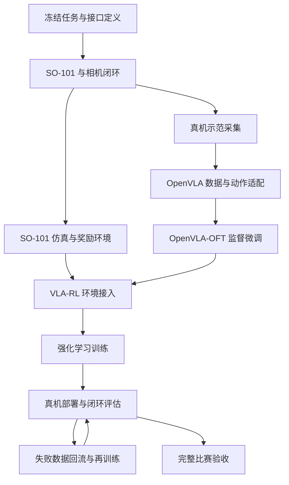

# SO-101 实体机械臂 VLA-RL 项目

## 总览

## 开发调试规范

- **以实际进展为准**：只记录已经确认的配置、操作和结果；未验证的内容明确标注，不把计划写成已实现的功能。
- **统一写作结构**：操作说明按照“为什么 → 怎么做”组织。先解释操作的原因及跳过它的影响，再说明程序解决问题的思路，最后给出命令行启动方式、操作步骤和成功判断方法。
- **保证操作可复现**：记录运行环境、代码版本、完整命令及关键参数。端口、设备类型和设备名称应与实际硬件一致。
- **保留排查依据**：遇到问题时记录原始报错、触发步骤、排查过程、确认的原因和修复后的验证结果，区分推测与已确认的结论。
- **逐步验证硬件**：先确认供电和通信，再完成舵机初始化、机械臂校准及后续控制调试。改接舵机线前先断开舵机电源；首次动作测试使用小幅度动作，并确保能够及时停止。
- **同步维护代码和文档**：启动命令、配置或操作流程变化后及时更新对应章节。密钥、数据集和模型权重不直接提交到仓库。

## 项目目录结构

当前仓库只建立项目自身的最小 Python 包结构。功能代码在对应功能开始开发时逐步加入：

```text
real_so101_vla_rl/
├── pyproject.toml
├── src/
│   └── real_so101_vla_rl/
│       ├── data/             # 数据加载、转换和检查
│       ├── models/           # OpenVLA 模型适配与微调
│       ├── robot/            # SO-101 控制与安全接口
│       ├── envs/             # 仿真与真机环境
│       ├── rewards/          # 比赛规则对应的奖励计算
│       └── rl/
│           ├── rollout/      # 仿真与真机轨迹采集
│           ├── algorithms/   # 强化学习算法
│           └── trainer/      # VLA-RL 训练调度
├── configs/
│   ├── robot/                # 机器人与相机配置
│   ├── sft/                  # SFT-LoRA 配置
│   └── rl/                   # 强化学习配置
├── scripts/                  # 数据、训练、评估和部署入口
├── tests/                    # 自动化测试
├── RLinf/                    # 本地参考仓库，不纳入版本管理
└── SimpleVLA-RL/             # 本地参考仓库，不纳入版本管理
```

`RLinf/` 和 `SimpleVLA-RL/` 保持原样并由 `.gitignore` 忽略。项目后续只迁移实际需要的最小实现，迁移后的代码在本项目中独立维护；完成迁移和验证后可以删除本地参考目录。

## 第一章：so101组装与调试

### 1.1 舵机的标定与初始化

#### 为什么

机械臂校准前，需要先为每颗舵机设置唯一的 ID，并统一通信波特率。新舵机通常使用默认 ID，多颗舵机直接串联后可能出现 ID 冲突；如果 ID 或波特率与程序预期不一致，程序就无法正常识别和访问各个关节，影响后续机械臂的标定。

例如，运行 `lerobot-calibrate` 时出现以下报错，说明程序在连接检查阶段没有收到预期 ID 的舵机回复，尚未进入机械臂校准：

```text
Missing motor IDs:
  - 1 (expected model: 777)
  - 2 (expected model: 777)
  - 3 (expected model: 777)
  - 4 (expected model: 777)
  - 5 (expected model: 777)
  - 6 (expected model: 777)

Full found motor list (id: model_number):
{}
```

这个报错也可能由供电、端口或接线问题引起。本次排查中，已确认供电和端口无误，但跳过了舵机 ID 初始化，因此先补做初始化。

这里的 ID 初始化用于建立各关节的通信身份；后续的机械臂校准用于确定关节零位和运动范围，两步需要依次完成。

#### 怎么做

**程序解决问题的思路**

LeRobot 使用 `lerobot-setup-motors` 逐颗配置舵机。每次只将一颗舵机接入控制板，避免默认 ID 相同导致通信冲突。程序查找该舵机当前的通信参数，关闭其力矩输出，写入对应关节的目标 ID，并将波特率设置为总线使用的默认值。

这些参数保存在舵机内部，正常断电后仍然保留，因此通常只需初始化一次。当前本机版本按照以下顺序提示连接舵机：

| 操作顺序 | 程序提示名称 | 对应关节 | 目标 ID |
| --- | --- | --- | --- |
| 1 | `gripper` | 夹爪 | 6 |
| 2 | `wrist_roll` | 手腕旋转 | 5 |
| 3 | `wrist_flex` | 手腕俯仰 | 4 |
| 4 | `elbow_flex` | 肘部 | 3 |
| 5 | `shoulder_lift` | 肩部抬升 | 2 |
| 6 | `shoulder_pan` | 底座旋转 | 1 |

**命令行启动与操作**

以下以 leader 臂为例，已确认其端口为 `/dev/ttyACM0`。在终端中运行：

```bash
conda activate lerobot

lerobot-setup-motors \
  --teleop.type=so101_leader \
  --teleop.port=/dev/ttyACM0
```

1. 根据终端提示确定当前需要设置的舵机。
2. 断开舵机电源，让控制板只连接当前指定的那一颗舵机。该舵机的另一个接口也不能继续串联其他舵机；机械结构可以保持装好。
3. 恢复舵机供电，再按 Enter，让程序配置该舵机。USB 可以保持连接。
4. 确认终端显示该舵机 ID 设置成功，例如 `'gripper' motor id set to 6`，再根据下一条提示重复上述操作。
5. 六颗舵机全部设置成功后，断开舵机电源，恢复完整串联接线，再重新供电。

随后启动机械臂校准：

```bash
lerobot-calibrate \
  --teleop.type=so101_leader \
  --teleop.port=/dev/ttyACM0 \
  --teleop.id=my_leader_arm
```

`--teleop.id=my_leader_arm` 是用于关联校准文件的机械臂名称，不是舵机 ID，也不会替代初始化操作。

程序通过连接检查并提示将机械臂移动到运动范围中间位置，说明已经进入校准流程；接着按终端提示完成中间位置及关节运动范围采集。出现 `Calibration saved to ...` 后，确认校准文件已保存。

如果初始化时单颗舵机就无法识别，应保留完整报错，检查该舵机的供电、接线及型号，解决后再继续。

## 第二章：初赛任务需求分析

### 2.1 任务目标与规则边界

初赛任务为“机械臂多色电池识别与序列摆放（线上）”。比赛使用统一任务底图和四块外形、尺寸一致的红、蓝、黄、绿电池。机械臂需要完成颜色识别、抓取、搬运和放置，全程只允许机械臂及末端执行器动作，机械臂底座必须固定。

初赛包含两个任务：

1. **基础单块抓取与放置**：根据公布的目标颜色，从电池初始摆放区抓取一块电池，放入基础目标区 `T0`。
2. **指定序列精度摆放**：根据比赛当日公布的三色顺序，依次把对应电池放入序列区 `P1`、`P2`、`P3`。每个位置有外框和内框，进入外框可获得基础放置分，完整进入内框可获得精度分。

比赛总分 100 分：基础单块抓取与放置 40 分、指定序列精度摆放 50 分、时间效率 10 分。单次比赛建议在 180 秒内完成。参赛视频必须为单镜头连续、未经剪辑的完整录像，比赛过程中不得人工干预机械臂或修正电池位置。

本项目先采用单臂方案。规则允许单臂或双臂参赛，双臂不额外加分，因此单套 SO-101 follower 臂已经能够覆盖初赛任务。

### 2.2 功能拆分

完整任务可以拆成“接收任务 → 感知场景 → 选择目标 → 抓取 → 搬运 → 放置 → 验证结果”的闭环。

#### 2.2.1 任务指令输入

系统需要支持两类任务参数：

- 单块任务：输入一种目标颜色，例如“将红色电池放入 T0”。
- 序列任务：输入三个有顺序的目标颜色，例如“蓝、红、黄”，并依次映射到 `P1`、`P2`、`P3`。

首版可以通过命令行参数或配置文件输入任务，后续再接入自然语言指令。无论采用哪种输入方式，程序内部都应转换成统一的数据结构，例如：

```text
任务类型：sequence
目标序列：[blue, red, yellow]
目标区域：[P1, P2, P3]
```

#### 2.2.2 场景感知

系统需要从相机画面中获得以下信息：

- 识别红、蓝、黄、绿四种电池。
- 确定每块电池在初始区中的位置和朝向。
- 确定 `T0`、`P1`、`P2`、`P3` 的位置。
- 区分序列区的外框与内框，为高精度放置提供目标范围。
- 在抓取和放置后确认电池是否仍在夹爪中、是否进入目标区域。

比赛工位、底图和电池初始区域固定，因此首版可以在固定相机下标定工作台坐标系，在预设区域内完成颜色检测和位置估计，不需要一开始就解决任意场景中的通用目标检测。

#### 2.2.3 坐标标定与目标转换

视觉系统得到的是图像坐标，机械臂执行动作需要机械臂坐标。程序需要建立二者之间的转换关系：

```text
相机像素坐标 → 工作台坐标 → 机械臂抓取/放置位姿
```

需要保存初始区、`T0`、`P1`、`P2`、`P3` 的可操作位置，并验证机械臂能够在不移动底座的情况下到达所有区域。序列区放置位姿应以电池完整进入内框为目标，给定位误差预留余量。

#### 2.2.4 单块稳定抓取

抓取流程至少包含：

1. 移动到目标电池上方的预抓取位置。
2. 调整夹爪方向，使其与电池姿态匹配。
3. 垂直下降并闭合夹爪。
4. 垂直抬升，避免拖动或撞倒其他电池。
5. 保持至少 2 秒，确认电池已经稳定离开支撑面。

抓取功能的验收条件与评分规则一致：颜色正确、电池稳定离台、没有明显碰倒大量非目标电池，也没有反复失控抓取。

#### 2.2.5 搬运与避碰

机械臂抓住电池后，需要沿合法路径从初始区移动到目标区。程序需要：

- 规划抬升、水平搬运和下降三个阶段的安全轨迹。
- 保证电池在整个搬运过程中不掉落。
- 避开其他电池、工作台边缘和机械臂自身。
- 在连续摆放三块电池时避免碰撞已经放好的电池。
- 限制关节位置、速度和动作幅度，出现异常时能够立即停止。

#### 2.2.6 基础目标区放置

基础任务需要将指定颜色电池搬运至 `T0` 上方，再放入 `T0`。放置流程至少包含到达目标上方、下降、松开夹爪、稳定等待和撤离。电池主体位于 `T0` 内并在释放后稳定 3 秒，才算完成完整放置。

#### 2.2.7 序列区精确摆放

序列任务需要按照任务口令依次执行三次抓取和放置，并保证颜色与位置对应。例如口令为“蓝、红、黄”时，蓝色进入 `P1`、红色进入 `P2`、黄色进入 `P3`。

每次放置都需要满足：

- 当前颜色和目标位次正确。
- 电池主体完整进入目标位外框。
- 尽量完整进入内框，以获得精度分。
- 松开夹爪后稳定至少 3 秒，不滑出、不弹出、不倾倒。
- 三次操作连续执行，无人工干预、明显长时间停滞或严重掉落中断。

#### 2.2.8 流程控制与异常处理

程序需要用明确的任务状态管理整轮操作：

```text
初始化 → 读取任务 → 识别全部电池 → 抓取目标 → 检查抓取
       → 搬运 → 放置 → 检查放置 → 执行下一目标 → 完成
```

需要识别并处理目标未找到、抓取失败、电池掉落、目标区被占用和关节越界等异常。恢复动作必须由程序自主完成，比赛过程中不能依赖人工调整机械臂或电池。

#### 2.2.9 计时、日志与比赛录像

程序应记录任务口令、每个阶段的开始和结束时间、识别结果、目标位姿、机械臂状态以及失败原因，方便按评分项复盘。录像需要完整展示机械臂、工作台、任务底图、全部电池和清晰计时画面，并在开始时展示本轮任务口令、电池初始状态和机械臂初始状态。

### 2.3 实现优先级

第一阶段先形成可得基础分的最小闭环：

1. 完成 follower 臂初始化、校准和全工作区可达性测试。
2. 固定相机和任务底图，完成相机到机械臂坐标标定。
3. 识别四种颜色，并输出每块电池的抓取位置。
4. 稳定完成指定颜色电池到 `T0` 的抓取与放置。
5. 将同一流程扩展到 `P1`、`P2`、`P3`，实现三色顺序执行。
6. 优化内框放置精度、连续执行稳定性和总耗时。

本项目采用 VLA-RL 路线：先使用预训练 VLA 和真机示范数据进行监督微调，使模型获得基础抓取与放置能力；再通过强化学习优化任务成功率、精确放置、连续执行和失败恢复。固定工位标定、动作限幅、异常停止和奖励判定仍由机器人环境提供，作为 VLA-RL 训练与部署所需的基础设施。

### 2.4 阶段验收标准

| 阶段 | 可验证结果 |
| --- | --- |
| 硬件与标定 | follower 臂可稳定连接；所有任务区域均可达；关节无越界和碰撞 |
| 颜色感知 | 四种颜色均能正确识别；能输出对应电池位置和朝向 |
| 单次抓取 | 指定电池离台并稳定保持 2 秒，不明显碰倒其他电池 |
| T0 放置 | 电池主体进入 `T0`，释放后稳定保持 3 秒 |
| 序列放置 | 三种颜色按口令进入 `P1`、`P2`、`P3`，且全部进入外框 |
| 精度优化 | 三块电池均完整进入对应内框并稳定保持 3 秒 |
| 完整比赛流程 | 无人工干预、单次连续完成，耗时不超过 180 秒，并能生成完整日志和合规录像 |

### 2.5 VLA-RL 可行性评估

#### 结论

经过本任务真机数据微调和强化学习后，VLA 有能力完成初赛需求。基础单块抓取与 `T0` 放置的可行性较高；三块连续顺序摆放也能够实现，但完整进入内框、连续三次不失败以及自主恢复是主要风险。因此，项目目标应分为“完成任务”和“稳定取得高分”两个层级，不能以少量成功演示代替正式成功率评估。

这一判断成立需要满足以下条件：

- 使用与比赛一致的 SO-101、夹爪、相机视角、底图和电池采集真机数据。
- 数据覆盖四种颜色、不同初始槽位、`T0` 和 `P1`～`P3` 目标位以及合理的位置偏差。
- 模型以关节状态、相机图像和语言子任务作为输入，输出 SO-101 的六维关节动作。
- 训练数据包含稳定抬升、垂直放置、释放后撤离等完整动作，而不只包含最终成功画面。
- 强化学习奖励能够自动、可靠地判断抓对颜色、稳定离台、进入外框、进入内框、稳定释放、掉落和碰撞。
- 推理速度能够满足闭环控制频率，且部署时使用动作限幅、关节限位和异常停止机制。

#### 各项能力预估

| 需求 | VLA 完成能力 | 主要风险 |
| --- | --- | --- |
| 理解单色或三色语言口令 | 高 | 训练时颜色名称和口令格式覆盖不足 |
| 从四块电池中选择正确颜色 | 高 | 光照、白平衡或夹爪遮挡造成颜色混淆 |
| 单块抓取并稳定离台 | 较高 | 电池姿态偏差、夹爪落点和夹持力不稳定 |
| 放入较大的 `T0` 区域 | 较高 | 相机或机械臂位置发生偏移 |
| 按顺序放入 `P1`～`P3` 外框 | 中等偏高 | 长流程误差累积，已放电池改变后续画面 |
| 三块全部完整进入内框 | 中等 | SO-101 回差、视觉深度误差和释放后的滑动 |
| 掉落或抓偏后的自主恢复 | 中等 | 失败样本少，训练奖励过于稀疏 |

以上是满足数据覆盖和闭环部署条件后的工程预估，不是现有预训练模型直接零样本运行的能力。预训练 VLA 必须先适配本机相机、SO-101 动作空间和电池任务。

#### 连续任务的成功率要求

三块序列摆放会放大单次动作的不稳定性。如果每块电池从抓取到放置的成功率为 `p`，暂时忽略各次操作间的相关性，三块全部成功的概率约为 `p³`：

| 单块成功率 | 三块全部成功率 |
| --- | --- |
| 80% | 51.2% |
| 90% | 72.9% |
| 95% | 85.7% |
| 97% | 91.3% |

因此，若希望单轮三块任务达到约 90% 的完成率，每次抓取并放置的成功率需要接近 97%。训练不能只看单块成功案例，必须单独统计完整三块序列成功率。

#### 推荐的 VLA-RL 任务组织方式

比赛口令先由任务调度器转换成三个语言子任务，再由同一个 VLA 连续执行。例如：

```text
比赛口令：蓝、红、黄

子任务 1：抓取蓝色电池并放入 P1
子任务 2：抓取红色电池并放入 P2
子任务 3：抓取黄色电池并放入 P3
```

每个子任务完成后，根据新相机观测判断是否成功，再进入下一子任务。这个结构仍然由 VLA 根据视觉和语言生成动作，但能降低一次长动作序列同时记忆颜色顺序、完成进度和目标位置的难度，也便于对各阶段设置奖励。

训练流程规划为：

```text
真机遥操作示范采集
        ↓
预训练 VLA 的监督微调（SFT）
        ↓
真机离线评估与失败数据补采
        ↓
构建自动奖励和 SO-101 训练环境
        ↓
VLA 强化学习微调
        ↓
固定测试集评估和比赛流程验证
```

首轮数据可以从每种子任务约 50 条高质量轨迹开始验证。若要覆盖四种颜色、不同初始位置和四个目标区域，预计需要数百条经过平衡采样的有效轨迹；实际数量应由独立测试集成功率决定，而不是预先固定。

强化学习奖励应与比赛评分保持一致，使用阶段性奖励降低稀疏性：正确颜色、稳定离台、到达目标上方、进入外框、进入内框和稳定释放分别给正奖励；抓错、掉落、碰撞、越界和超时给负奖励。内框精度和完整三块成功应获得更高权重。

#### 当前代码基础的限制

- LeRobot 已经提供 SO-101 的相机观测、六个关节状态和关节动作接口，也提供适合 SO-101 真机微调与推理的 VLA 实现。
- 当前 `SimpleVLA-RL` 代码主要支持 OpenVLA/OpenVLA-OFT 在 LIBERO 和 RoboTwin 中训练，其公开代码尚未直接提供 SO-101 真机强化学习环境。
- 当前 `RLinf` 包含 LeRobot 数据接口和部分模型的 SO-101 动作配置，但公开的真机环境列表中没有可直接运行的 SO-101 环境。

因此，项目不能直接运行现有 VLA-RL 示例完成比赛。需要实现一层 SO-101 适配：统一观测和动作格式、连接真机 rollout、自动复位或训练回合管理、比赛规则奖励、动作安全限制及评估记录。

## 第三章：OpenVLA + VLA-RL 开发任务清单

### 3.1 技术路线约定

本项目确定使用以下技术路线完成初赛：

- **机器人与数据层**：使用 LeRobot 驱动 SO-101 leader/follower、采集遥操作轨迹并保存图像、关节状态、动作和语言指令。
- **基础模型**：使用预训练 OpenVLA，不从零训练视觉语言模型。
- **监督微调**：采用 OpenVLA-OFT 的连续动作预测和 action chunk 方案，将 OpenVLA 适配为输出 SO-101 六维关节动作的策略。
- **强化学习**：以监督微调模型为初始策略，使用 VLA-RL 优化完整任务成功率、序列执行、精确放置和失败恢复。
- **RL 主框架**：优先基于 `SimpleVLA-RL` 适配 OpenVLA-OFT 和 SO-101；`RLinf` 的真机环境设计作为实现参考，第一版不同时维护两套训练入口。
- **训练算力**：训练任务在云端 GPU 服务器运行；本地电脑负责真机控制、数据采集、奖励观测和安全停止。部署阶段根据延迟测试决定使用云端推理还是下载模型到本地 GPU 设备。
- **任务执行方式**：比赛口令拆成单块语言子任务，由同一个 VLA 依次执行；任务调度器负责子任务顺序、完成判断和重试次数。

VLA 是机械臂动作的生成策略，规则判定器、训练奖励、安全限幅、计时和日志属于训练与部署环境，不要求模型自行学习这些确定性规则。

### 3.2 最终交付目标

系统接收一条单色或三色任务口令，根据相机图像和机械臂关节状态连续生成动作，在不移动底座、没有人工干预的情况下完成：

```text
四色识别 → 正确抓取 → 稳定离台 → 安全搬运
         → T0 或 P1/P2/P3 精确放置 → 稳定释放
```

最终系统需要提供一条可复现的比赛启动命令、确定版本的模型权重和配置、自动评分日志以及符合比赛要求的连续录像。

### 3.3 总体依赖关系



### 3.4 分阶段开发清单

#### 阶段 0：冻结任务定义和接口

- [ ] `T0`、`P1`、`P2`、`P3` 以及四个初始槽位使用统一名称和坐标定义。
- [x] 定义单块任务和三块序列任务的机器可读格式。
- [x] 定义颜色枚举：`red`、`blue`、`yellow`、`green`。
- [x] 定义回合的 `success`、`failure`、`timeout` 和 `abort` 条件。
- [ ] 将比赛得分项和扣分项转换成程序可记录的事件。
- [ ] 固定观测、动作、控制频率、图像分辨率和时间戳格式。
- [ ] 固定机器人、相机、任务底图和电池的安装与复位方法。

**阶段产物**：任务配置格式、SO-101 环境接口文档和比赛评分事件表。

**完成标准**：后续数据采集、仿真、训练和评估使用同一套字段与坐标定义，不再分别解释动作或任务标签。

#### 阶段 1：完成 SO-101 真机基础闭环

- [ ] 初始化并校准 leader 臂和 follower 臂的全部舵机。
- [ ] 验证 follower 六个关节状态能够连续读取，目标关节位置能够稳定下发。
- [ ] 验证 leader 到 follower 的遥操作方向、零位和夹爪开合一致。
- [ ] 固定俯视工作区相机；如单目画面不能可靠判断抬升和掉落，再增加侧视相机。
- [ ] 完成相机采集、关节状态和动作的时间同步测试。
- [ ] 验证机械臂能够到达四个初始槽位、`T0`、`P1`、`P2` 和 `P3`。
- [ ] 实现初始姿态、休息姿态和安全撤离姿态。
- [ ] 实现关节限位、单步动作限幅、通信超时停止和人工急停。
- [ ] 连续运行真机读写测试，确认没有随机断连、异常跳变或舵机过热。

**阶段产物**：真机配置文件、相机配置、遥操作启动方式、安全控制封装和硬件检查记录。

**完成标准**：操作者能够遥操作 follower 从任意初始槽位抓取电池并放到所有目标区域，且全过程无关节越界和结构碰撞。

#### 阶段 2：建立示范数据采集流水线

- [x] 为单块任务生成统一语言指令，例如 `Pick up the red battery and place it in T0.`。
- [x] 为序列任务生成三个带目标位次的子任务指令。
- [x] 首版训练使用规范英文指令；比赛中文任务由上层调度器转换，后续按需要增加双语数据。
- [ ] 使用 leader 遥操作 follower，按 LeRobotDataset 格式同步记录相机、关节状态、动作、任务文本和时间戳。
- [ ] 平衡覆盖四种颜色、不同初始槽位、四个目标区域及小范围位置和角度偏差。
- [ ] 每条成功轨迹包含预抓取、下降、闭合、抬升、搬运、下降、释放、稳定等待和撤离全过程。
- [x] 定义 episode 成功状态和失败类型，并让 SFT 数据选择只接受成功轨迹。
- [ ] 实现轨迹回放、图像预览、动作曲线和时间同步检查工具。
- [x] 实现按 `layout_id` 分组的 episode 级训练集、验证集和测试集划分，避免同一布局跨集合泄漏。
- [ ] 先采集小规模试验集打通训练，再逐步扩充到覆盖完整变化的数百条有效轨迹。

**阶段产物**：版本化 LeRobot 数据集、数据统计报告、数据检查工具和固定测试集。

**完成标准**：任意一条轨迹都能从任务文本、图像和状态重建出正确动作；训练集覆盖统计不存在明显的颜色、槽位或目标区域偏斜。

#### 阶段 3：实现 SO-101 到 OpenVLA 的适配层

- [x] 定义 OpenVLA 输入：相机图像、六维关节状态和语言子任务。
- [ ] 将 LeRobotDataset 转换或直接加载为 OpenVLA-OFT 所需的数据结构。
- [x] 固定 SO-101 六维绝对关节目标的名称、顺序和单位。
- [x] 实现训练集关节动作及状态的 `BOUNDS_Q99` 归一化统计结构和计算函数。
- [x] 配置长度为 8 的 action chunk、30 FPS 时间偏移和 episode 尾部补齐掩码。
- [ ] 实现模型输出反归一化、关节名称映射和动作安全裁剪。
- [ ] 验证数据加载后图像通道、关节顺序、夹爪方向和语言指令均正确。
- [ ] 使用记录轨迹执行离线前向推理，确认模型输出维度、数值范围和动作时间顺序正确。

**阶段产物**：数据适配器、SO-101 动作头配置、归一化文件和离线推理测试。

**完成标准**：一批真实数据能够完成前向传播和损失计算，预测动作可以无歧义地转换成 follower 接受的六个关节目标值。

#### 阶段 4：完成 OpenVLA-OFT 监督微调基线

- [ ] 在云服务器创建可复现的 CUDA、PyTorch、OpenVLA-OFT 和 LeRobot 环境。
- [ ] 固定预训练 OpenVLA 检查点、代码提交号和依赖版本。
- [ ] 先用少量数据执行单批次过拟合和短训练，验证训练链路。
- [ ] 优先使用 LoRA 完成第一轮微调，再根据效果和显存决定是否扩大可训练参数。
- [ ] 记录训练损失、验证损失、学习率、吞吐量和检查点。
- [ ] 导出可用于闭环推理的权重、处理器和归一化配置。
- [ ] 在固定测试集上评估颜色条件、动作误差和不同子任务表现。
- [ ] 将模型接入 follower，以低速、短 action chunk 和人工监护完成首次闭环 rollout。
- [ ] 收集抓错、抓偏、早放、放置偏移和停滞等 SFT 失败案例。

**阶段产物**：OpenVLA-OFT SFT 基线权重、训练配置、离线指标和真机基线成功率报告。

**完成标准**：模型能够在测试场景中根据不同颜色和目标区域产生不同动作，并稳定完成部分真机抓取放置；未达到该标准前不进入 RL。

#### 阶段 5：实现仿真任务和自动奖励

- [ ] 在 `SimpleVLA-RL` 支持的仿真环境中加入 SO-101 模型、夹爪和正确关节约束。
- [ ] 复现比赛底图、四个初始槽位、`T0`、`P1`～`P3` 外框和内框。
- [ ] 随机化颜色排列、电池小范围位置与角度、相机误差和光照。
- [ ] 让仿真观测和动作字段与真机接口一致。
- [ ] 实现正确颜色、稳定抓取、离台、到达目标上方、进入外框、进入内框和稳定释放奖励。
- [ ] 实现抓错、掉落、碰撞、越界、超时和扰动非目标电池惩罚。
- [ ] 实现任务完成、失败终止、最大步数和环境复位。
- [ ] 使用脚本策略或示范轨迹检查每个奖励是否在正确时刻触发。
- [ ] 使用录制视频建立真机自动评分器，并与人工标注对比，验证奖励判定可信度。

**阶段产物**：SO-101 比赛仿真环境、真机奖励判定器、回合管理器和奖励测试集。

**完成标准**：成功轨迹的累计奖励明显高于失败轨迹；外框、内框、稳定时间和扣分事件与人工判断一致。

#### 阶段 6：接入并训练 VLA-RL

- [ ] 将 SO-101 仿真环境接入 `SimpleVLA-RL` 的 rollout 接口。
- [ ] 从阶段 4 的 SFT 权重初始化策略，禁止从随机策略直接进行真机探索。
- [ ] 配置策略更新、参考策略约束、采样温度、回合长度和检查点频率。
- [ ] 先在单块 `T0` 任务上验证 rollout、奖励回传和参数更新闭环。
- [ ] 扩展到一个电池进入 `P1`～`P3` 的精确放置训练。
- [ ] 扩展到三块序列任务，增加连续完成和失败恢复奖励。
- [ ] 监控奖励投机行为，防止模型通过推、撞或错误占位获得非预期奖励。
- [ ] 分别评估训练内场景、未见颜色排列、位置扰动和相机扰动。
- [ ] 保存 SFT 与各 RL 检查点，在完全相同的测试集上比较成功率。

**阶段产物**：可复现的 VLA-RL 配置、训练曲线、模型检查点、仿真评估视频和消融对比。

**完成标准**：RL 模型在独立仿真测试集上的完整任务成功率和内框放置率稳定高于 SFT 基线，且没有增加碰撞、掉落或越界。

#### 阶段 7：真机推理与强化学习闭环

- [ ] 实现本地机器人进程和 GPU 推理进程之间的请求协议。
- [ ] 每次请求包含最新图像、关节状态、当前子任务和时间戳；每次响应包含 action chunk、模型版本和生成时间。
- [ ] 测量云端往返延迟、抖动、丢包和实际控制频率。
- [ ] 实现动作缓存、滚动重规划、过期动作丢弃和网络中断停止。
- [ ] 本地安全层在任何情况下都对关节动作进行限位和限幅。
- [ ] 先使用记录观测进行影子推理，再进行低速真机 rollout。
- [ ] 使用固定测试集评估 sim-to-real 差距，并补充真实失败数据。
- [ ] 将真机成功、失败和人工安全中止分别标注后回流训练。
- [ ] 在可控复位和人工监护下进行少量真机 RL；任何危险动作立即终止并赋予失败奖励。
- [ ] 根据真机结果重新调整视觉随机化、动作噪声、奖励和数据分布。

**阶段产物**：推理服务、本地机器人客户端、安全监控、真机 rollout 数据和 sim-to-real 调整记录。

**完成标准**：网络异常不会产生失控动作；RL 模型真机成功率高于 SFT 基线，并能在固定条件下重复完成任务。

#### 阶段 8：实现比赛任务调度器

- [ ] 支持单色任务：指定颜色映射到 `T0`。
- [ ] 支持三色任务：颜色序列依次映射到 `P1`、`P2`、`P3`。
- [ ] 在每个子任务开始前生成规范化语言指令。
- [ ] 在每个子任务结束后自动判断成功、失败或是否允许重试。
- [ ] 已放置电池进入后续观测，模型不得碰倒或重复抓取。
- [ ] 实现整轮计时、阶段耗时和 180 秒超时终止。
- [ ] 记录每一步的输入、模型输出、实际执行动作、奖励和判定结果。
- [ ] 提供一条命令启动相机、机器人、推理服务连接、任务和日志记录。

**阶段产物**：完整比赛执行器、任务配置、状态日志和一键启动入口。

**完成标准**：更换任务口令后无需修改代码，系统可自动完成对应的单块或三块任务。

#### 阶段 9：系统评估与比赛验收

- [ ] 建立与比赛评分表一致的自动评估报告。
- [ ] 单独统计颜色识别、稳定抓取、外框放置、内框放置、稳定释放和完整序列成功率。
- [ ] 使用未进入训练集的颜色排列和初始摆放完成正式测试。
- [ ] 每个关键版本执行足够轮次，报告成功率和置信区间，不以少量成功录像代替评估。
- [ ] 统计平均耗时、最长耗时、掉落次数、碰撞次数、重试次数和安全中止次数。
- [ ] 以单块抓取放置成功率接近 97% 作为三块任务达到约 90% 成功率的优化目标。
- [ ] 验证机械臂初始状态、底座固定、无人工干预和全程连续执行。
- [ ] 验证录像能同时清晰展示机械臂、工作台、底图、全部电池、任务口令和计时画面。
- [ ] 冻结最终代码、模型权重、配置、依赖和启动步骤，并完成两次模拟正式比赛。

**阶段产物**：最终评估报告、完整比赛录像、发布模型和可复现运行包。

**完成标准**：完整流程在固定测试集上达到目标成功率和精度，最长有效回合不超过 180 秒，无危险动作和人工干预。

### 3.5 开发顺序与里程碑

| 里程碑 | 包含阶段 | 目标 |
| --- | --- | --- |
| M0：接口冻结 | 阶段 0 | 统一任务、观测、动作、奖励和配置定义 |
| M1：真机可控 | 阶段 1 | SO-101、相机、遥操作和安全控制稳定 |
| M2：数据可用 | 阶段 2～3 | 数据能直接进入 OpenVLA 并正确映射回 SO-101 动作 |
| M3：SFT 基线 | 阶段 4 | OpenVLA-OFT 首次完成真机抓取放置 |
| M4：RL 可训练 | 阶段 5～6 | SO-101 仿真、自动奖励和 VLA-RL 训练闭环跑通 |
| M5：RL 上真机 | 阶段 7 | RL 模型安全部署，真机表现超过 SFT |
| M6：比赛闭环 | 阶段 8～9 | 单色和三色任务均可一键运行并通过正式验收 |

第一轮开发从 M0 和 M1 开始。当前最先要完成的任务依次为：

1. 完成 leader/follower 初始化、校准和遥操作验证。
2. 固定任务底图、SO-101 底座和相机位置。
3. 定义六维关节状态、六维关节动作、相机图像和任务文本的数据接口。
4. 实现安全动作下发与硬件检查程序。
5. 采集约 10 条试验轨迹，验证 LeRobot 数据的图像、状态、动作和语言同步。
6. 用试验数据打通 OpenVLA 数据加载和单批次训练，再开始正式扩充数据集。
