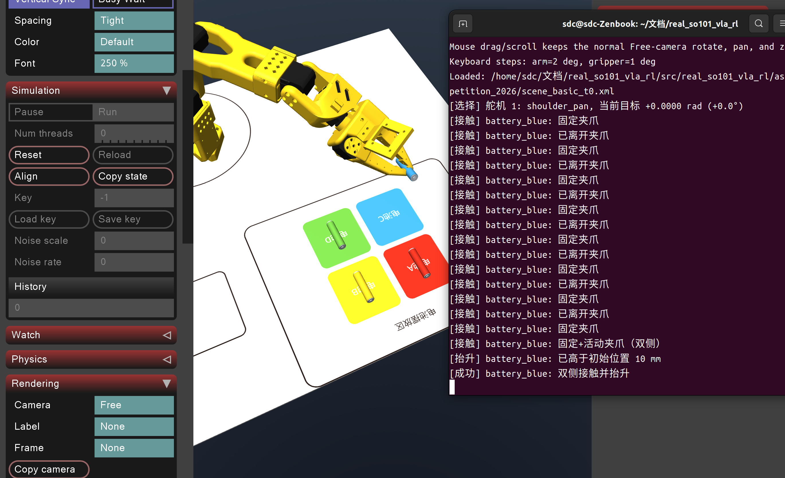

# 2026 挑战赛 MuJoCo 双底图场景

这个目录保存项目自有的 2026 挑战赛场景资产，并引用项目中原样 vendored 的
`../SO101_menagerie/` 机械臂网格。当前包含完整 SO101 动力学模型、静态底板、
四个动态彩色电池代理方块、标注纹理、标定灯光、腕部相机和 overview 相机。任务奖励和
Gymnasium/RL 代码位于项目的 `rewards/`、`envs/basic_t0.py` 和 `rl/`，不写入
MJCF 资产文件。

## 当前完成状态

两套任务底图、SO101 完整动力学模型、四个动态彩色方块及交互抓取 Demo 已完成集成。
每个方块边长 `20 mm`，净质量 `0.096 kg`，与当前真机电池代理物一致。

原有 `basic_t0` 人工抓取验收使用的是旧 AAA 圆柱模型，只能作为控制器与夹爪链路的
历史证据，不能证明本次替换后的方块接触和抓取参数已经通过人工验收。新方块模型需要
重新执行 `basic_t0` 手动抓取回归；`sequence_p1_p2_p3` 也仍需单独验收完整操作路径。
当前已经为 `basic_t0` 实现目标区域判定、轻量随机复位、特权状态观测、连续
action chunk、分阶段奖励、终止条件以及 PPO/GRPO baseline；目标区域判定会使用
方块当前姿态的完整 XY 投影，序列场景的对应任务环境尚未实现。

## 文件

- `source/challenge_task_board_2026.pdf`：原始双页底图留档。
- `layouts.yaml`：物理尺寸、坐标、颜色和纹理生成参数的唯一数据源。
- `alignment.yaml`：底座、真机关节中位读数与范围、Orbbec 内外参、灯光和后处理版本。
- `textures/basic_t0.png`：电池摆放区 + T0，`2800×2200` RGB。
- `textures/sequence_p1_p2_p3.png`：电池摆放区 + P1/P2/P3，`2800×2200` RGB。
- `so101_competition.xml`：基于 Menagerie 模型的比赛坐标适配层。
- `battery_cubes.xml`：两个场景共享的四个动态彩色方块定义。
- `scene_basic_t0.xml`、`scene_sequence_p1_p2_p3.xml`：可独立加载的 MJCF。

两套第三方原始资产分别位于相邻的 `../SO101/` 和 `../SO101_menagerie/`；
来源、许可证与逐文件校验值记录在 `../THIRD_PARTY.md`、
`../SO101_NEXUS_LICENSE.md` 和 `../SO101_NEXUS_SHA256SUMS`。

## 模型引用关系

两个 `scene_*.xml` 是最终场景入口，同时共享机械臂适配模型和电池代理方块集合。
机械臂适配模型再读取原样 vendored 的 Menagerie STL 网格：

```text
scene_basic_t0.xml ───────────────┬─ include → so101_competition.xml
                                  │                         │
                                  │                         └─ meshdir → ../SO101_menagerie/assets/*.stl
                                  └─ include → battery_cubes.xml → 四个方块

scene_sequence_p1_p2_p3.xml ──────┬─ include → so101_competition.xml
                                   │                         │
                                   │                         └─ meshdir → ../SO101_menagerie/assets/*.stl
                                   └─ include → battery_cubes.xml → 四个方块
```

运行 MuJoCo 时只需加载对应的 `scene_*.xml`。`so101_competition.xml` 和
`battery_cubes.xml` 都不是额外任务场景，分别是共享的机械臂定义和方块定义。

## 尺寸与坐标

原 PDF 页面标注尺寸为 `700×540 mm`，而派生仿真底板按项目决定使用
`700×550 mm`。这个 10 mm 差异是有意保留的，使数字尺寸优先的
`250 mm 电池区 + 100 mm 间隔 + 200 mm 底座圆`恰好容纳于底板高度。

世界原点在机械臂底座圆心：`x` 指向底图右侧，`y` 指向远离机械臂的方向，
`z` 向上。底座圆直径为 `0.20 m`，与底图下边缘相切。底板世界边界为：

```text
x: [-0.392853, 0.307147] m
y: [-0.100000, 0.450000] m
```

MJCF 中的 `board_collision` 是顶面位于 `z=0` 的有限静态 box；
`board_visual` 是稍高于顶面的无碰撞纹理 plane，因此图像不会改变未来物体的接触行为。

## SO101 模型

比赛场景使用 `SO101_menagerie/so101.xml` 的完整动力学模型，包括 6 个关节、
6 个位置执行器、操作碰撞体、`gripperframe` TCP site 和 `wrist_cam`：

```text
shoulder_pan
shoulder_lift
elbow_flex
wrist_flex
wrist_roll
gripper
```

vendored 原件保持不变。项目自有的 `so101_competition.xml` 调整网格路径，并将
机械臂根基座绕世界 `z` 轴旋转 `+90°`，使模型自身的 `+x` 前向与任务底图的
世界 `+y` 对齐。基座根节为 `(0, 0.035365, 0)`，使朝任务区的前端与 `y=+0.100 m` 切线对齐。
前五轴 `ref` 为真机标定中位的 LeRobot 读数；真机角度数值直接对应 MuJoCo `qpos`
角度数值，夹爪按 `1% → 1°`。两个场景的完整 `home` keyframe 使用记录的真机
起始读数作为关节位置和控制目标。夹爪原有约 `-10～100°` 的关节与控制限位保持不变。
外壳材质为微暖白色，黑色舵机材质保持不变。

离线验证发现，记录的真机起始读数在当前场景中使夹爪碰撞体与底板最大穿透约
`9 mm`；位置控制器推进后，肩抬会偏离起始目标约 `3.7°`。数值坐标已经对齐，
但该起始姿态的碰撞几何还需单独校准，不能用关节零偏掩盖这一问题。
使用原始真机采集重新生成的 `calibration/live-home-v1/report`，机械臂轮廓 IoU
约为 `0.37`；这份报告不能作为全工作区几何吻合的验收证据。

## 电池代理方块模型

`battery_cubes.xml` 集中定义红、黄、蓝、绿四个电池代理方块，分别对应底图的
A、B、C、D 位置。每个实物和仿真方块的边长均为 `20 mm`，净质量为
`0.096 kg`。该数值作为整个方块的质量，不包含机械臂或底板。

MuJoCo 的 box `size` 使用半尺寸，因此碰撞几何写为
`size="0.010 0.010 0.010"`、`mass="0.096"`。同尺寸的彩色 visual geom 不参与
接触且质量为零；刚体惯量由 MuJoCo 根据立方体碰撞几何和质量计算。


`alignment.yaml` 保留 Orbbec/OpenCV 的绝对主点
`(321.62958, 236.77197)`。MuJoCo 的 `principalpixel` 语义是相对图像中心的
偏移，因此两个 MJCF 场景写入的是 `(1.62958, -3.22803)`；这两个值表达同一个
`640×480` 相机内参，不能互换。overview 的 RGB 输出随后统一应用 Brown–Conrady
畸变、颜色、gamma、暗角、模糊和受环境 seed 控制的噪声。
为兼容现有状态、奖励、Demo 和 checkpoint 接口，body/joint 仍保留 `battery_*`
内部名称。每个 body 都有独立 `freejoint`，能够被夹爪抓取、推动、翻滚和掉落：

```text
battery_red       / battery_red_joint
battery_yellow    / battery_yellow_joint
battery_blue      / battery_blue_joint
battery_green     / battery_green_joint
```

共享文件中的规范布局使用 `basic_t0` 的 A/B/C/D 中心，初始中心高度为
`z=0.010 m`，使方块底面位于 `z=0` 的底板顶面。`scene_basic_t0.xml` 以零偏移
引用它；序列场景通过外层 `<frame>` 将整组方块沿世界 `-x` 平移
`0.037866 m`，从而与该页底图的四个占位中心对齐。

增加两个场景共同使用的代理物时，只需在 `battery_cubes.xml` 中增加 body，并同步更新
`layouts.yaml`。若以后两个场景需要不同数量或不能用同一个刚性偏移表达的布局，应由
场景生成脚本或 RL reset 逻辑设置，而不复制方块的几何定义。

## 底图源文件校验

```text
SHA-256  f537b63235542f3a509b6f695651a486232e65c02d21fc457a876f893eb277c6
```

生成脚本会先校验此哈希，再使用 `Noto Sans CJK SC` 按锁定米制坐标重绘纹理。
它不拉伸或截图 PDF；尺寸文字、底座圆直径、10/15 cm 虚线和区域尺寸说明由 `layouts.yaml` 以可复现方式补回。运行 MuJoCo 时只读取已提交的 PNG，
不需要字体、Pillow 或原 PDF。

## 重新生成纹理

```bash
conda run -n lerobot python scripts/generate_competition_2026_boards.py
```

若字体不在默认 Linux 路径，传入 `--font /path/to/NotoSansCJK-Regular.ttc`。
对 TrueType Collection 还可用 `--font-index` 选择 SC 字体面；系统默认 TTC 的 SC 索引为 2。

## 人工验收

### 真机带动单臂仿真：关节方向目视检查

在项目根目录、已安装 LeRobot 与 MuJoCo 的 `lerobot` 环境中运行：

```bash
python scripts/demo_so101_live_mirror.py
```

脚本使用 `configs/recording/so101_t0_100_lowlight_v1.yaml` 中的 follower 串口；
串口不同可加 `--port /dev/ttyACM0`。它先核对舵机内标定与
`calibration/lerobot/robots/so_follower/my_follower_arm.json`，再提示托住机械臂。
按 Enter 后脚本关闭六轴扭矩，约每秒读取 20 次真机关节位置，并直接刷新最简
MuJoCo 单臂姿态。关闭窗口会断开串口，扭矩保持关闭。运行时不向真机下发位置目标。

默认使用正式转换接口：前五轴真机度数与仿真角度数值相同，夹爪百分数与仿真
角度数值相同。按 `1～5` 选择关节、`F` 临时翻转所选关节的显示方向、`P` 打印
六轴真机与仿真角度。`F` 仅用于目视诊断，不修改正式映射参数。

现存人工验收截图记录的是旧 AAA 圆柱模型：`basic_t0` 交互 Demo 当时已完成机械臂
控制、夹爪闭合和电池抓取/抬升，可作为控制链路的历史回归基线。



截图左侧显示旧蓝色模型被夹爪夹持并离开底板；右侧终端记录了固定夹爪与活动夹爪
同时接触、物体高于初始位置 `10 mm` 和抓取成功诊断。该证据不验证当前
`20 mm`、`0.096 kg` 方块的接触参数；方块模型需要重新完成同一手动抓取回归。
无论旧、新模型，该检查都不代表自动放置、序列任务、奖励或 RL 策略已经完成。

要在 T0 场景中通过键盘或 Viewer 右侧 actuator 滑块控制机械臂、手动测试方块抓取，运行：

```bash
conda run --no-capture-output -n lerobot \
  python scripts/demo_mujoco_t0_grasp.py
```

先用顶排数字 `1～6` 选择对应真实舵机 ID：底座旋转、肩部抬升、肘部、腕部俯仰、
腕部旋转和夹爪；再用 `A/D` 减小/增大所选目标，选择夹爪时分别表示闭合/打开。
`Space` 暂停/继续，`Backspace` 完整复位。脚本会撤销这些控制键同时触发的 Viewer
显示开关，因此操作时不会隐藏机械臂、方块或改变可视化效果。终端会报告当前选择、
目标角度、单侧/双侧夹爪接触、方块抬升 10 mm，以及“双侧接触并抬升”的成功诊断。

若只想确认场景能加载并稳定运行而不打开 GUI，可执行：

```bash
conda run -n lerobot python scripts/demo_mujoco_t0_grasp.py --headless-check
```

也可以继续直接打开两个原始 Viewer 场景：

```bash
/usr/bin/python3 -m mujoco.viewer \
  --mjcf=src/real_so101_vla_rl/assets/mujoco/competition_2026/scene_basic_t0.xml

/usr/bin/python3 -m mujoco.viewer \
  --mjcf=src/real_so101_vla_rl/assets/mujoco/competition_2026/scene_sequence_p1_p2_p3.xml
```

Viewer 默认使用斜俯视的 `Free` 相机，可用鼠标拖拽旋转、平移和缩放。
选择固定相机 `overview` 可以查看完整任务底图；`wrist_cam` 是机械臂自带的腕部相机。
